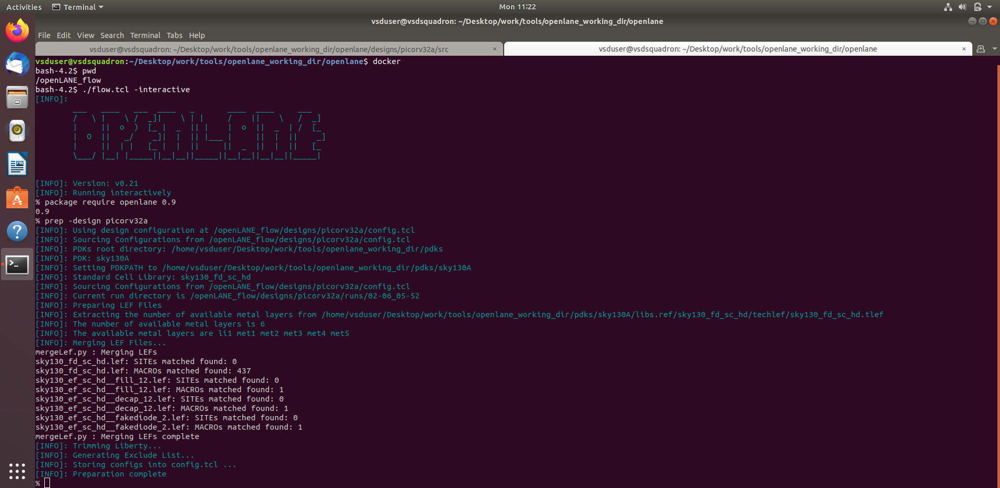

# SKY130 Day 1: Inception of OpenSource EDA, OpenLANE and SKY130 PDK
## How to Talk to Computers
Example of QFN-48 package was given.
Below is a schematic drwan by the author to show layout of chip. 

A chip is inside a package, and is connected to various io pins. A chip is also a complex system, and has various components such as -:

-**PADS** : They act as connectors between the IC and chip. Pads are structures for sending electrical signals inside the chip. They are strategically placed and made with respect to the pins.

-**CORE** : This is the digital logic (i.e. the various gates such as AND, OR, XOR etc and the MUXes) is placed. It carries out all processor functions.

-**DIE** : A die is a part of semiconductor wafer that can be used independently in various devices. It can contain more than one core.

The core also has various components, which can mainly be segregated into -

-**FOUNDRY IPs** : These are components that are provided to the designer of the SoC by the foundry (i.e. a factory where chips are produced). These components are usually pre-designed and tested by the foundry. Foundry IPs can include PLLs, adc0, adc1, SRAMs and various other components.

-**MACROs** : Macros are very similar to Foundry IPs, but consist of pure digital logic, that is pre-made for certain common use-cases and can be easily integrated into a SoC or Integrated Circuit (IC). Macros can be of various types such as a GPIO bank and SPI etc.

Above we can see .exe runs actually. First, the application is made in embeddded C code which is then translated into assembly langauge by the compiler according to the ISA of the particular chip and then to machine language(binary language) by the assembler. Machine language is then understood by the hardware. This all happens in system software which consist of- 

**Operating systems** - OS perform a variety of functions such as I.O. operation, memory allocation and low level system function. They produce functions in languages such as C, C++, VB and Java, which are sent to the compiler.

**Compilers** - Compilers produce simple instructions (the format of which depends on the hardware) in the form of .exe documents, which are to the assemblers. These instructions are abstract interfaces between complex coding languages like C/C++ and hardware, and hence are called ISAs. They are known as the architechture of the computer.

**Assemblers** - Assemblers convert the instructions from the compilers into binary, and the function is implemented.

## SoC Design and OpenLANE
### Instructor- Mohamed. Shalan
An ASIC is contributed by RTL IP's, EDA tools and PDK data.

> RTL IPs

RTL (Register Transfer Level) IPs are reusable building blocks written in hardware description languages (HDLs) like Verilog or VHDL. These modules define the behavior of digital circuits at a fundamental level and are typically pre-designed and verified for use in larger systems.

> EDA Tools

Electronic Design Automation (EDA) tools are software used for designing, simulating, verifying, and analyzing circuit designs. Common open-source tools include OpenSTA (for timing analysis), OpenRoad (for physical design), and others that support the complete ASIC design flow.

> PDK Data

A Process Design Kit (PDK) is a collection of data and configuration files provided by semiconductor foundries. It includes process design rules, device models, standard cell libraries, and I/O libraries—essential for accurate ASIC design and simulation.

Until June 2020, there was no open-source PDK available, which made it difficult to perform ASIC design using open-source tools. This changed when Google and SkyWater released an open-source 130nm PDK.

Although there's a common misconception that 130nm technology is outdated compared to modern sub-10nm nodes, this is not entirely accurate. The following points help clarify:

1.Many applications do not require bleeding-edge nodes; 130nm offers more than sufficient performance for these cases.

2.The cost of fabrication at 130nm is significantly lower, making it ideal for prototyping, research, and cost-sensitive products.

3.130nm chips are not inherently slow. Performance benchmarks from Intel and OSU have shown that designs on this node can achieve competitive speeds for various applications.

## RTL to GDS flow

The RTL to GDSII ( Register Transfer Level to Graphic Design System II) design process takes many steps, that are :

> Synthesis

Synthesis is the process of translating a hardware description language (such as Verilog) into a gate-level netlist using standard cells from a predefined library. These cells have a consistent physical structure and come with multiple representations—such as electrical, behavioral (HDL), and transistor-level (SPICE)—to support various stages of the design and verification process.

> Floorplanning

Floorplanning involves organizing the physical layout of major components on a chip to balance performance, area efficiency, and interconnect complexity. It plays a critical role in:

1. Minimizing wire lengths to reduce delay,

2. Improving signal integrity,

3. Managing power distribution effectively, and

4. Maximizing overall chip area utilization.

> Power Planning
 
Power planning ensures that all parts of the chip receive stable and sufficient power. It involves designing an efficient Power Distribution Network (PDN) to:

1. Reduce voltage drops and power noise,

2. Minimize resistance and capacitance in power lines, and

3. Deliver consistent power across the chip.

Power is typically delivered through VDD pads, which connect to internal components via wide, parallel metal traces to reduce resistance.

> Placement

Placement determines the exact locations of all components—including standard cells, macros, and I/O pads—within the chip layout. Standard cells are usually arranged on predefined rows aligned to placement sites. This process includes:

'Global placement' , which provides a rough estimate of positions for optimal overall layout.

'Detailed placement' , which refines those positions to meet design rules and timing constraints.

> Clock Tree Synthesis (CTS)

CTS is performed prior to routing and focuses on distributing the clock signal to all clocked elements (flip-flops, latches, etc.) with minimal skew and balanced delay. A well-designed clock tree is essential for reliable synchronous operation.

> Routing

Routing defines the actual metal paths that electrically connect all the placed components. The process uses multiple metal layers (e.g., 6 in Sky130) whose dimensions and characteristics are defined by the PDK. Routing is responsible for ensuring that all nets are connected while minimizing parasitics and adhering to spacing rules.

> Sign-off Stage

Before a design is sent for fabrication, it undergoes several critical verification steps:

1. Design Rule Check (DRC): Verifies that the layout adheres to the manufacturing constraints provided by the foundry. It helps prevent physical defects during fabrication.

2. Layout Versus Schematic (LVS): Compares the layout-derived netlist against the original schematic to confirm they represent the same circuit functionality.

3. Static Timing Analysis (STA): Analyzes all timing paths in the circuit to ensure that setup and hold times are met, and that the design can operate correctly at the target clock frequency.

> Synthesis

*   Generating gate-level netlist (yosys).
*   Performing cell mapping (abc).
*   Performing pre-layout STA (OpenSTA).

> Floorplanning

*   Defining the core area for the macro as well as the cell sites and the tracks (init_fp).
*   Placing the macro input and output ports (ioplacer).
*   Generating the power distribution network (pdn).

> Placement

*   Performing global placement (RePLace).
*   Perfroming detailed placement to legalize the globally placed components (OpenDP).

> Clock Tree Synthesis (CTS)

*   Synthesizing the clock tree (TritonCTS).

> Routing

*   Performing global routing to generate a guide file for the detailed router (FastRoute).
*   Performing detailed routing (TritonRoute)

> GDSII Generation

*   Streaming out the final GDSII layout file from the routed def (Magic)

## Introduction to OpenLANE and Strive Chipsets

OpenLANE is an open-source digital ASIC jointly developed by efabless and Google, designed to automate the entire design process flow based on several components including OpenROAD, SPEF-Extractor, KLayout and a number of custom scripts for design exploration and optimization. It aims to create a clean GDSII (i.e. no LVS violations, no DRC violations, and no timing violations) with no human intervention. striVe is family of SoCs created by Efabless. __There are two mode of operations - automation and interactive__ .

Synthesis Exploration generates a delay vs area report.

Design Exploration sweeps design configuration and subsequently find best configuration for any given design.

Logic Equivalence Check (LEC) - checks that the physical implementation and the netlist have the same logic. It is performed each time netlist is modified and checks that changing netlist did not change function.

Antenna Rule Check- When a metal wire segment is fabricated it can act as antenna.\
-Reactive ion etching causes charge to accumulate on the wire.\
-Transistor gates can be damaged during fabrication.

Where a preventive approach would be adding a fake antenna diode to every cell input after placement, if running on magin on routed layoutgives error then replace fake one with real.

Timing Analysis (STA) - Here, the input also contains a synthesized netlist along with other data.

## Get Familiar to Opensource EDA tools

We can see in my working dirctory i have openlane and pdk. pdk contains three variant inside it - skywater-pdk, open_pdks and sky130A. While sky130A have libs.tech and libs.ref file which we are concerned with.  libs.tech contain all the tools needed for the flow. libs.ref contain all the technological information required by the flow. In libs.ref, at the bottom we can see sky130_fd_sc_hd which we will use.

Below is the Screenshot of commands ran intially to get into openlane flow.

We can see designs directory have many designs and I have worked with picorv32a.

Insdie picorv32a we have three main directories - 
1. src - which contain .sdc and verilog file.
2. config.tcl
3. sky130A_sky130_fd_sc_hd_config.tcl
   

Below are snapshots of config.tcl and sky130A_sky130_fd_sc_hd_config.tcl.\
Also we can observe there is a runs file created at bottom which is created when we prepare design and run the flow in openlane. 

## Design preparation steps

Below you can see the Docker commands. I am running an interactive flow using `./flow.tcl -interactive` . After that i did `package require openlane 0.9` and `prep -design picorv32a`. The commands when run, sets up a filesystem where the OpenLANE can store the results. This creates a folder inside the picorv32a directory which contains the command log files, results, and the reports dumped of the various tool. The folder will be only have the lef files generated by this design setup stage. The cell LEF files .lef and technology LEF files .tlef merge to generate merged.lef inside runs/tmp/, wherein a a folder with today's date will be created, inside which a tmp folder will have contents, and the merged.lef folder will contain the merged lef files.

This is the merged.lef file. At this stage if we check results and reports directories they will be empty but only tmp file will contain files. We can see in the image down the merged.lef.

Runs folder also contain cmds.log and config.tcl file which are shown below.

Now, I had started it by `run_synthesis`. Below. You can see the successful synthesis being done. Above two are of intermediate process.

Now, I have checked in the runs folder. We can see results/sythesis have a verilog file and reports/synthesis contains many reports mainly yosys and STA reports. Down you can look `yosys_4.stat.rpt` and `opensta.timing.rpt` 

### Steps to Charecterise Synthesis Results

After synthesis, there are printing statistics, which can be used to calculate flip-flop ratio.

FLIP FLOP RATIO = NO OF DFFs / NO OF CELLS * 100

NO OF DFFs = 1613

NO OF CELLS = 14876

FLIP FLOP RATIO = 10.843 %

We can also observe the chip area.

