# SKY130 Day 2: Good vs Bad Floorplan and Introduction to Library Cells

## Chip Floor Planning Considerations

### Utilisation Factor and Aspect Ratio

The first step in physical design is to define the width and height of the core and die : Beginning with a very simple netlist, we will first draw a basic diagram in the form of symbols that we will later convert into physical designs. We will take each cell (gates, specific cell like flip flop) and give it a standard  dimensions. As an example here, each unit will be 1 unit x 1 unit - i.e. 1 sq. unit in size, and since there are 4 gates/flip-flops here, the total size of the silicon wafer will 4 sq. units.

All logical cells will be placed inside the core - which is part of the die. If the logical cells occupy the core fully, it is known as 100% utilisation.

> Utilisation factor = Area occupied by netlist / Total area of core

In this case, we see that utilisation factor is 100%, but practically it is usually 50%. 

**Aspect Ratio** is the ratio between height and width. If the chip is square - it is 1, else the chip is rectangular in shape.

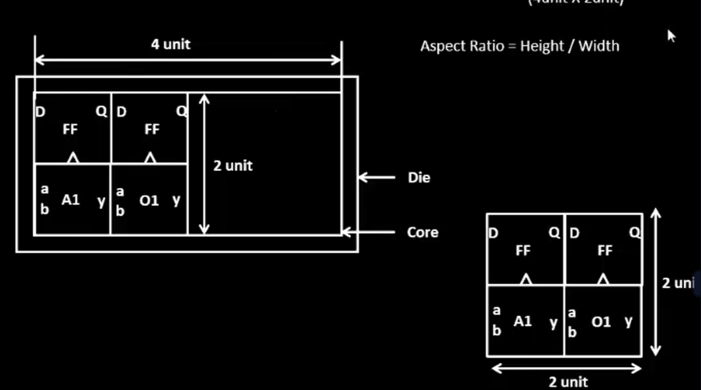

In the above example, the Utilisation factor is 50 % and

Aspect Ratio = 2 : 4 = 1 : 2 = .5

### Concept of Pre-Placed Cells

Pre-Placed cells are complex logic blocks that can be reused. They are already implemented and cannot be touched by Auto Place and Route tools - and hence are required to be very well designed, as they are fixed. Placed near the input side at well defined space. A combinational logic - such as netlist shown does a particular function and is composed of various gates. We can divide this logic into blocks - while preserving the connectivity of the logic. By extending IO pins and making connections we can convert the logic into two parts - that are blackboxed and used as needed. If a design only requires a black box, it can be directly handed over to the designer without much hassle. The preplaced blocks include memory, clock-gating cell, comparator, MUX. The arrangement of IPs in a chip is known as floorplanning.

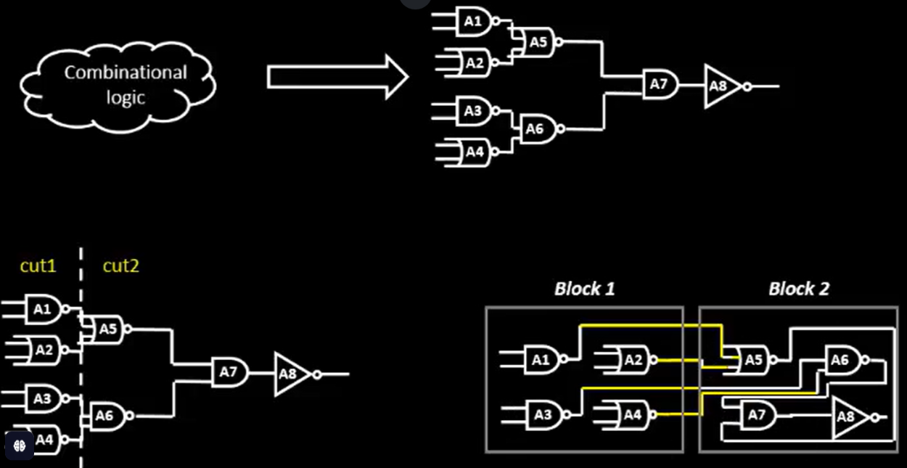

### Decoupling Capacitors

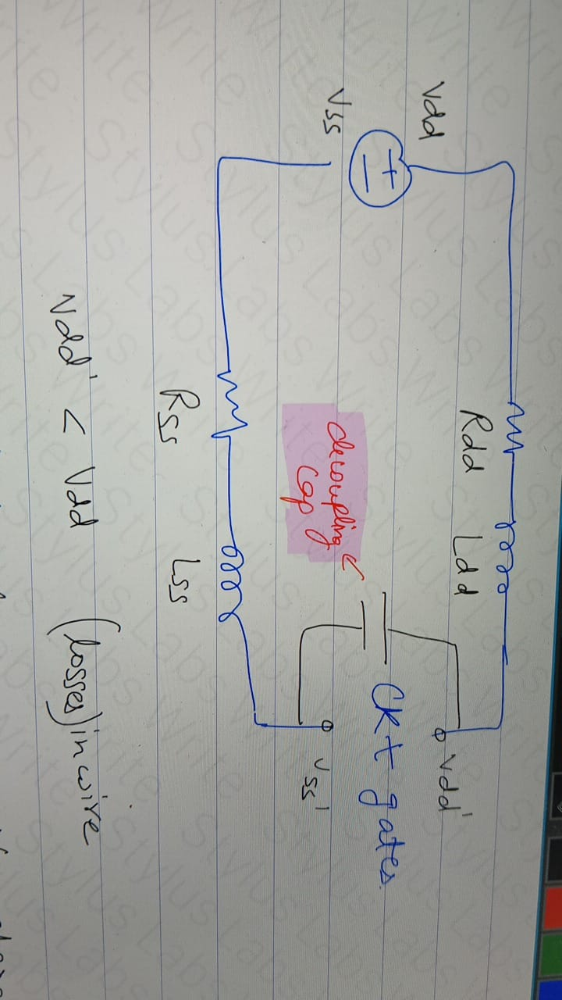

We place decoupling capacitors around pre-placed cells to ensure a stable power supply. When a circuit within a block is switched on, it demands current, which is supplied by the Vdd line. When the circuit is switched off, the excess charge is discharged to ground.

However, in practice, the voltage delivered to the circuit is not exactly equal to Vdd due to the resistance, inductance, and capacitance of the interconnects. This causes a slight drop in the supply voltage by the time it reaches the circuit, resulting in an effective voltage, Vdd', which must remain within the acceptable noise margin — typically defined between Vih and Voh. If Vdd' falls outside this range, the circuit may behave unpredictably or become unstable. This issue is amplified by the physical distance between the power source and the circuit.

Decoupling capacitors help address this problem. They act as local energy reservoirs charged to the supply voltage level. During sudden switching events, they supply or absorb current to maintain a stable local voltage. In essence, decoupling capacitors isolate the sensitive circuitry from fluctuations in the main power supply, ensuring that pre-placed cells receive a consistent and reliable Vdd, thereby enhancing circuit stability.

### Power Planning

Consider a specific logic block (or macro) that is replicated many times across a chip. Since it consumes significant power, decoupling capacitors are used to stabilize the voltage supply. However, it is not practical to add decoupling capacitors for the entire circuit, so only the most critical elements are typically decoupled.

For example, if a 16-bit bus drives a bank of inverters simultaneously, all associated capacitors may discharge at once. This simultaneous switching can lead to ground bounce, where a large return current causes a temporary rise in the ground potential. Similarly, when many devices switch on and draw current at the same time, it can cause a voltage drop on the Vdd line due to insufficient instantaneous current delivery. Both these effects can cause the local voltage (Vdd') to move outside the allowable noise margin (between Vih and Voh), risking circuit instability or logic errors.

To mitigate this, modern chips use power distribution networks or power meshes. These networks provide multiple power and ground taps spread across the chip. Decoupling capacitors then source current from the nearest Vdd and sink charge to the nearest Ground. This reduces the distance current must travel, minimizing inductive and resistive losses and thereby improving voltage stability across the chip.

Concept behind it is expressed in this slides which cane be understood easily.

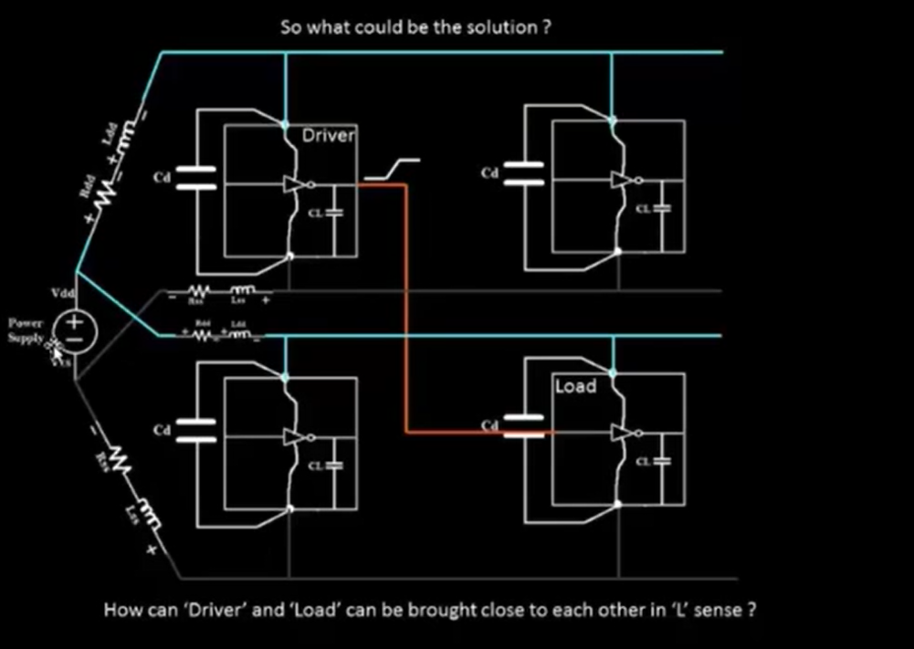
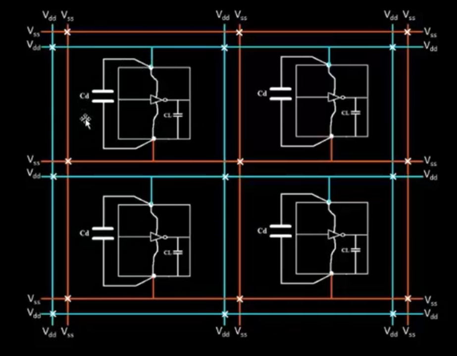
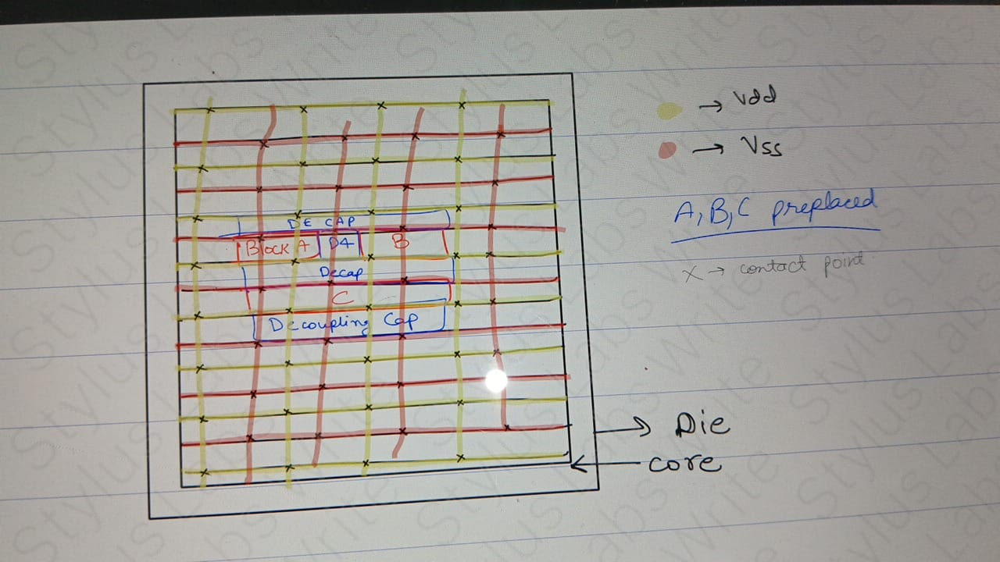

Here, We can block A, B, C, which are preplaced according to the rules and 4 decoupling capacitors are placed.

### Pin Placement and Logical Cell Placement Blockage

The input and output ports are placed left and right between the core and the die respectively. The placements of the ports is cell-specific. The clocks are continuously drive the cells and hence clock ports are bigger than data ports. Due to this, we also need the least resistance paths for the clocks. The size is inversely proportional to the resistance. Pins should be near to the place where they are required.

After the pin placement, we create Logical Cell Placement Blockage to ensure that the APR tool does not place any cell on the pin locations.

## Steps to Run Floorplan Using OpenLANE

The first step is setting the configuration variables - Before running floorplan, the configuration variables or switches must be set. These are present in openlane/configuration.

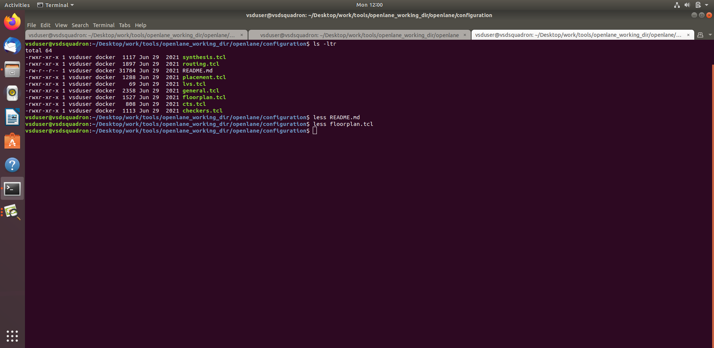

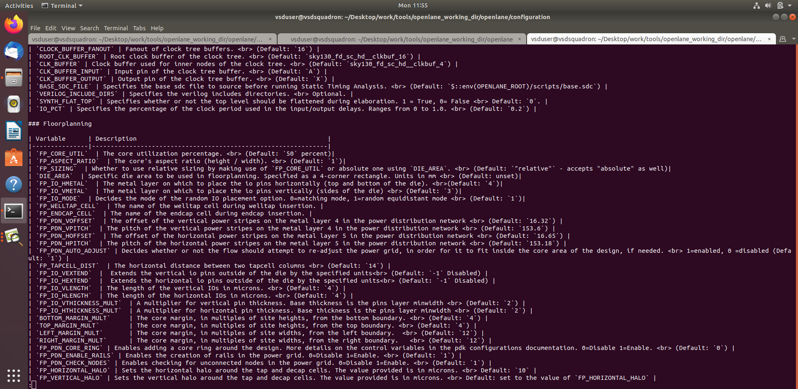

The README.md contains all configuration variables, which are segregated based on stage and the .tcl files consists of the default OpenLANE settings.

`In OpenLANE, it is important to note that the vertical and horizontal metals set one more than what we specify. For example, if the vertical metal is specified as 3, then it'll be 4.`

All configurations/switches accepted by the current run are from openlane/designs/[design - date]/config.tcl

It is important to note the order of priority among the files when flow decides to take value of variable-

1.openlane/designs/[design]/sky130A_sky130_fd_sc_hd_config.tcl

2.openlane/designs/[design]/config.tcl

3.openlane/configuration/floorplan.tcl 

Below we can see floorplan.tcl iin configurations directory

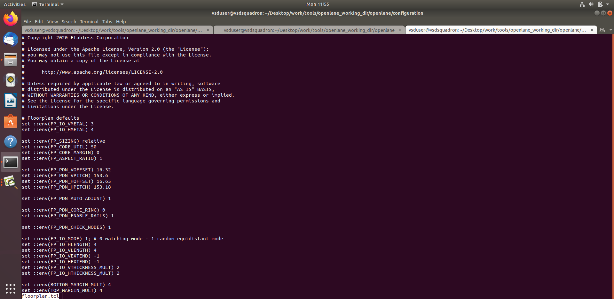

Floorplan is to be run on OpenLANE through the command :- run_floorplan

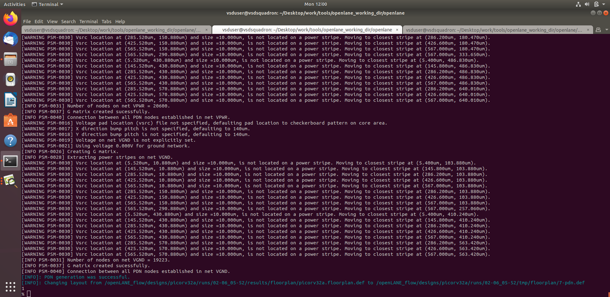

After running floorplan as above, it will produce a result that will be stored in the form of a design exchange format - and will contain the area of the Die as well as positions.
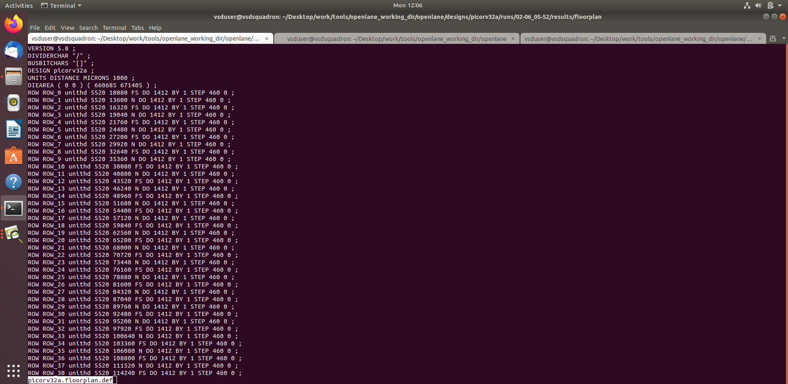

<!-- The die area in this file is in database units and 1 micron is equivalent to 1000 database units. Area of die = (554570/1000) microns * (565290/1000) microns = 311829.1653 sq. µm -->

### Review Floorplan Layout in Magic

The command magic -T /home/vsduser/Desktop/work/tools/openlane_working_dir/pdks/sky130A/libs.tech/magic/sky130A.tech lef read ../../tmp/merged.lef def read picorv32a.floorplan.def & should be typed to view the file.

The ioplacer file can be checked to understand the successful IO placement using this path `designs/picorv32a/runs/<date>/results/floorplan/`

> Here, My ioplacer is not as expected. Therefore, it have some issue. 

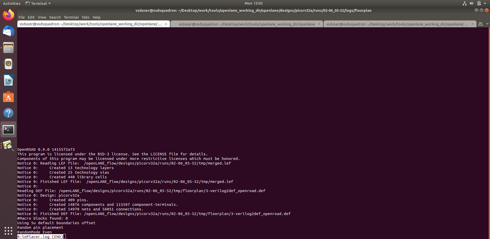

Now, We have flooplan in front of us in magic software. To select some part in magic we have to drag cursor on it and press S and to make the layout in center we can press V.

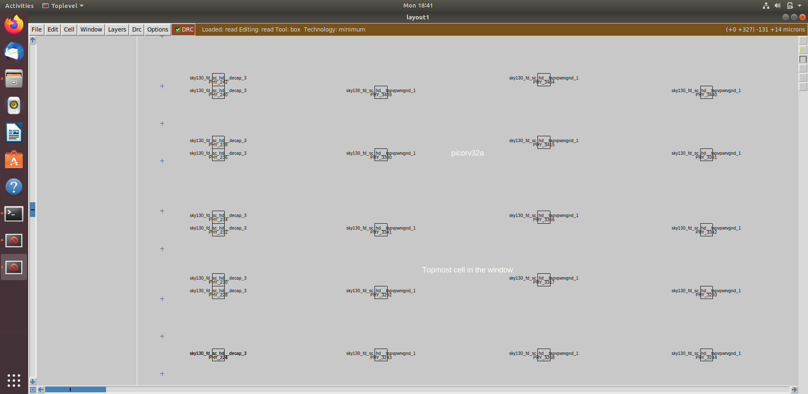
This is a closeup for the same.

IO pins would have been placed equidistant to one another in a random mode as based on the configuration (FP_IO_MODE = 1) set in openlane/configuration/floorplan.tcl but they are around lower left corner as it was set to 2.

Typing what on the tkcon window will give the layer of the selection.

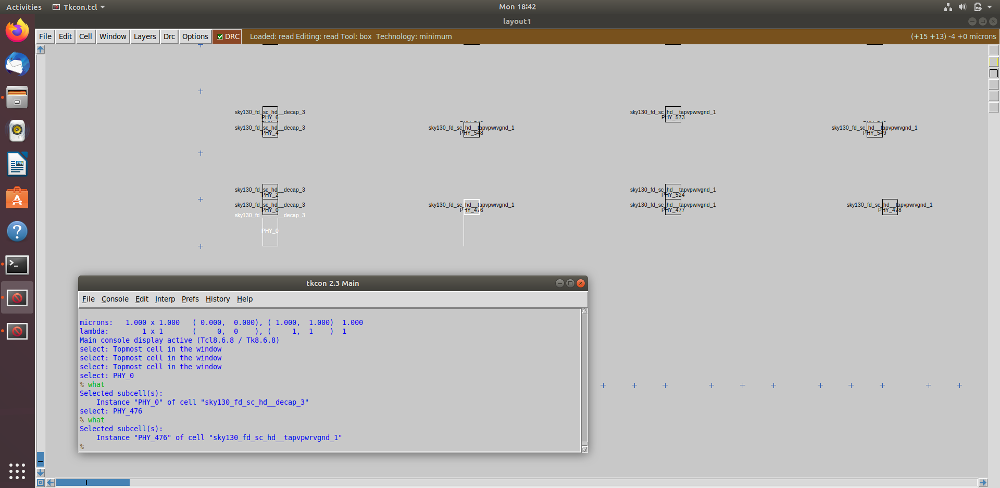

Standard cells are not placed but can be viewed at the bottom left corner of the layout. They will be placed after placement.

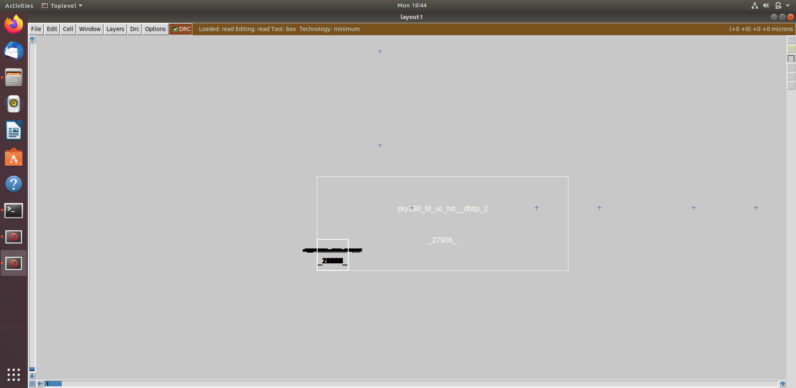

## Placement

The first step is to bind the netlist with physical cells i.e. cells with real dimension. These blocks are sourced from a "shelf", known as a library. The library has cells with various shapes, dimensions and also contains information about the delay information. The library contains various sizes of cells with the same functionality too - since bigger cells have lesser resistance.

The second step is PLACEMENT, which is done based on connectivity. As can be seen, flip flop 1 is close to the Din1 pin and flip flop 2 is close to Dout1 pin. Combinational cells are placed in close proximity to FF1 and FF2 as to reduce delay.

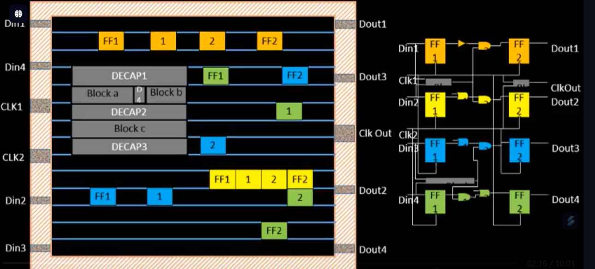

We will estimate wire length needed to connect the components together. If the wire length is too long, we would need to install repeaters, as the signal may change over a long distance. Repeaters essentially recondition the same signal to it's prior strength.

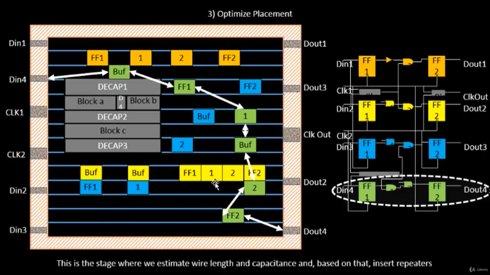

The command to run placement of OpenLANE - run_placement is a wrapper which does three functions

1. Global Placement (by using the RePlace tool) - there is no legalisation and HPWL reduction model is used
2. Optimization (by Resier tool)
3. Detailed Placement (by OpenDP tool) - legalisation occurs - where standard cells are placed in rows and there will be no overlap of the cells.

Placement aims to converge the overflow value.

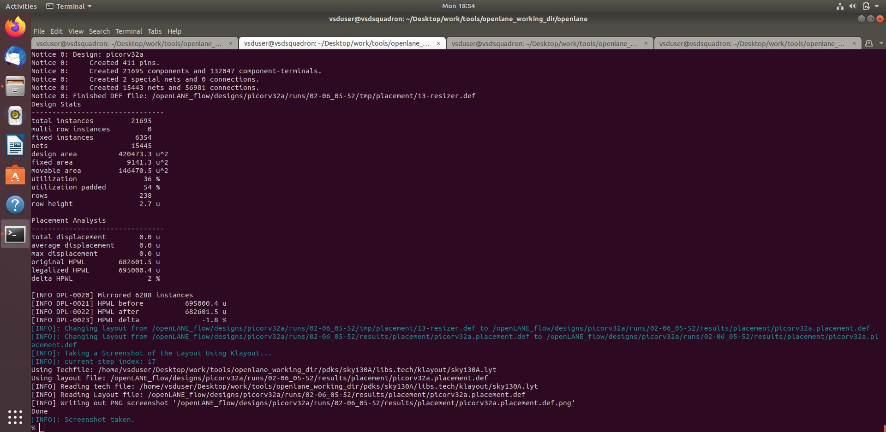

After running the placement, output is generated in this folder openlane/designs/picorv32a/runs/[design - date]/results/placement/picorv32a.placement.def

Then, we can type the command : magic -T /home/vsduser/Desktop/work/tools/openlane_working_dir/pdks/sky130A/libs.tech/magic/sky130A.tech lef read ../../tmp/merged.lef def read picorv32a.placement.def & to view it in Magic:

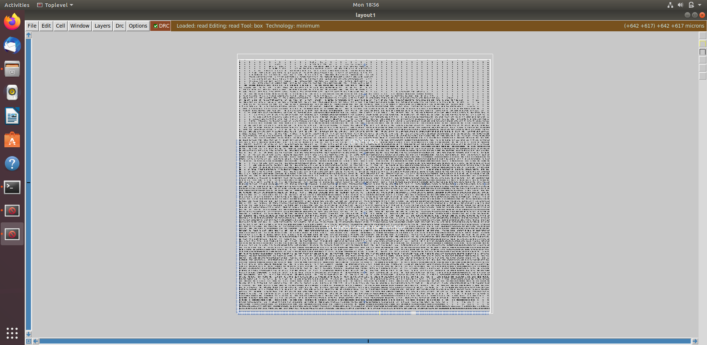
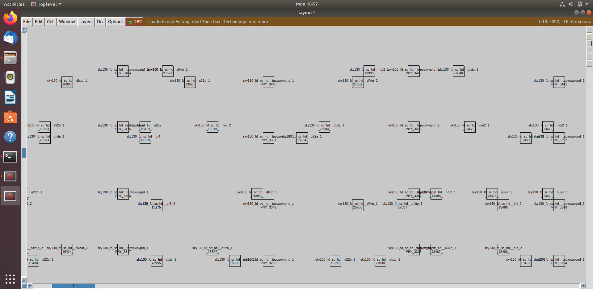

### Cell Design and Characterisation Flows

Standard cells like AND, OR, and BUFFER gates are stored in the standard cell library, with variations in drive strength, functionality, and threshold voltage (Vth). Higher drive strength supports longer wires, while higher Vth leads to slower switching.

> Standard Cell Design Flow:
> Inputs:

- PDKs: DRC & LVS rules, tech files, and layout parameters

 - SPICE Models: Device equations (threshold, linear, saturation) with foundry-specific parameters for NMOS/PMOS

 - User Specs: Cell height/width, supply voltage, pin positions, metal layer usage

> Processes:

 - Circuit design using NMOS/PMOS to meet spec

 - Layout design using Euler path/stick diagrams (e.g., in Magic)

 - Characterization for timing, power, noise

> Outputs:

 - CDL (Circuit Description Language)

 - GDSII (Layout)

 - LEF (for P&R)

 - Timing/Noise/Power data

 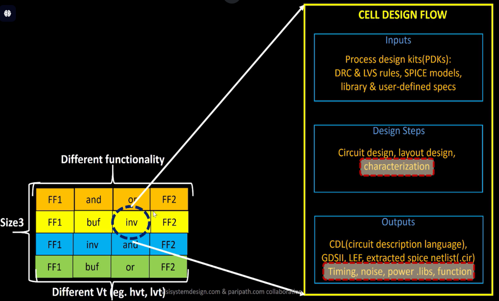

 ### Typical Characterization Flow
 
The standard cell characterization process involves the following steps:

1. Reading SPICE model files containing device-level parameters.

2. Importing the netlist extracted from SPICE simulations.

3. Identifying buffer behavior to understand drive strength and signal propagation.

4. Parsing subcircuits defined in the SPICE hierarchy.

5. Connecting required power supplies (VDD and GND) to the circuit.

6. Applying input stimulus to simulate switching activity.

7. Adding appropriate output load capacitance to mimic real usage conditions.

8. Defining simulation control commands (e.g., transient or DC analysis).

These steps are specified in a configuration file, which is fed into the characterization tool, typically GUNA. The tool performs simulations and generates timing, power, and noise models, which are output in the form of .lib (Liberty) files.

 ## General Timing Characterisation Parameters

 We will take this circuit as an example-
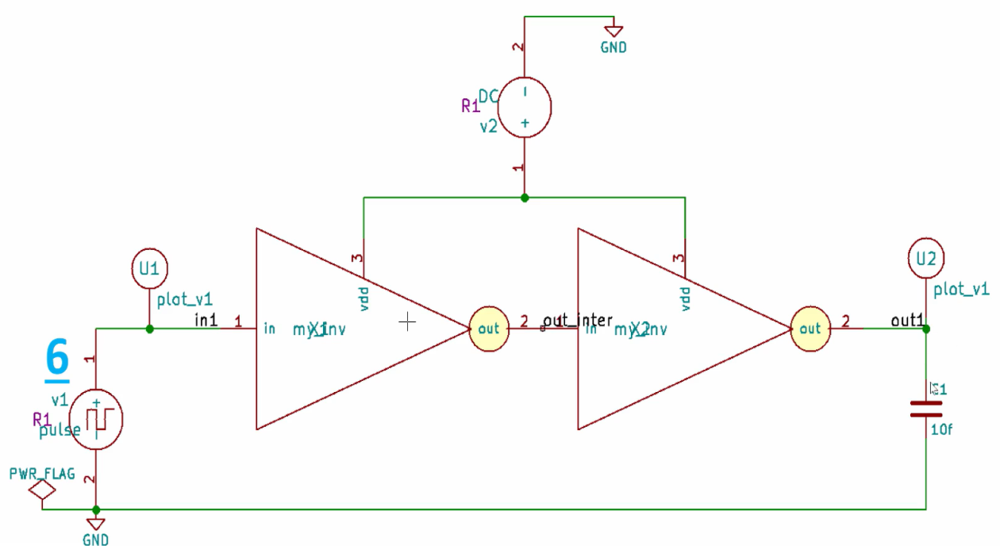
Here, the red line is output of first inverter and blue is output of second inverter.

There 8 parameters to be noted- 
1. slew_low_rise_thr
2. slew_low_fall_thr
3. slew_high_rise_thr
4. slew_high_fall_thr
5. in_rise_thr
6. in_fall_thr
7. out_rise_thr
8. out_fall_thr

### Propogation Delay and Transition Time

⏱️ 1. Propagation Delay (tpd)

> Definition:
>The time it takes for a change at the input of a gate to produce a corresponding change at the output.
> Propogation delay is calculated as = time(out_x_thr) - (time_x_thr)

Rise delay: out_rise_thr - in_rise_thr

Fall delay: out_fall_thr - in_fall_thr

 If the propagation delay is negative, it can cause quite unexpected results - as an output is generated before the input. Hence, threshhold values should be selected properly. Delay threshold is usually 50% and slew rate threshold is usually 20%-80%.

🔺 2. Transition Time (Slew)

> Definition:
> The time it takes for a signal to transition from low to high (rise time) or high to low (fall time).
> Transition time is calculated as = time(slew_high_x_thr) - time(slew_low_x_thr)

Time taken for the output to rise from `slew_low_rise_thr` to `slew_high_rise_thr`.

Time taken for the output to fall from `slew_high_fall_thr` to `slew_low_fall_thr`.

