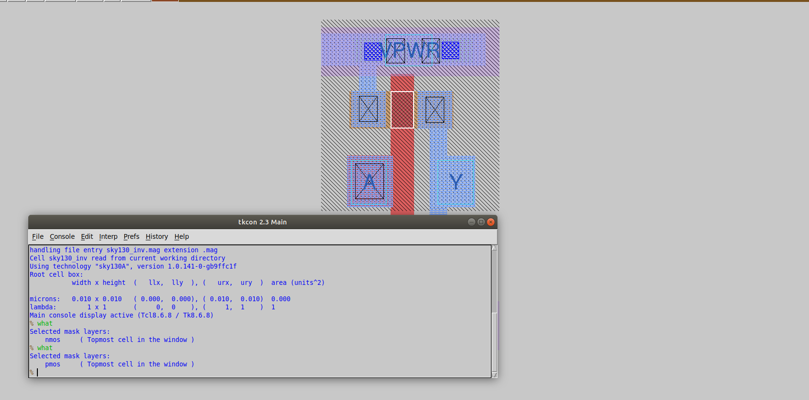
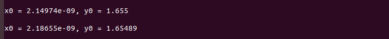
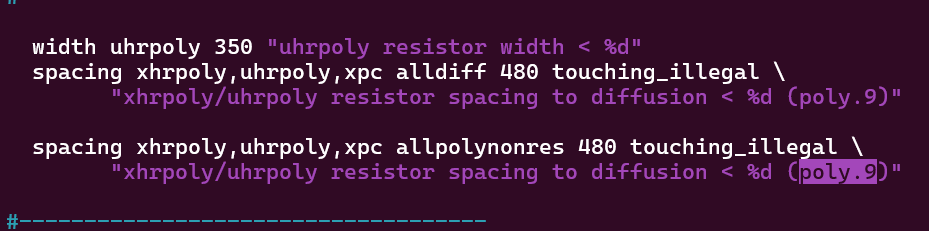

# SKY130 DAY 3: Design Library Cell Using Magic Layout and NGSPICE characterisation

### IO placer revision

OpenLANE configurations can be changed inside the shell itself, on the fly. IO Mode is usually set to random equidistant. However, if we want to change this, we can do so through the following command typed after floorplan : set ::env(FP_IO_MODE) 2. After running this command, the IO [input - output] pins will not be equidistant in mode 2 (instead of the default - that is 1).

> NOTE: changing the configuration on the fly will not change the runs/config.tcl, the configuration will only be available on the current session.

## Labs for CMOS Inverter NGSPICE Simulations

### SPICE Deck Creation For CMOS Inverter

The SPICE deck provides essential information such as netlist connectivity, input signal definitions, and output tap configurations. It also specifies component dimensions. For example, a typical PMOS transistor may have dimensions of 0.375 µm / 0.25 µm, where 0.25 µm is the channel length and 0.375 µm is the channel width. 0.25 umis a multiple of Vin(2.5).

In general, PMOS transistors are made 2 to 3 times wider than NMOS transistors. This is because holes (the charge carriers in PMOS) move slower than electrons (in NMOS). To balance the rise and fall times in CMOS logic gates, the resistance of the PMOS must be reduced—achieved by increasing its width. In the lecture, it was first demonstrated with an equal W/L ratio and then 3.75 times case i.e. 0.9375 µm / 0.25 µm.

In the later case, graph's intersection with Vin = Vout is at the center (~1.2) but in the equal ratio case it was at 1 approximately. Therefore, 2-3 times more is preferred. That intersection point is **Vm**(Switching threshold).

The similarity in the shapes of input-output voltage graphs indicates that CMOS is a robust technology. Two key parameters that determine this robustness are the **switching threshold and propagation delay**.

The switching threshold is the point at which the input voltage equals the output voltage. At this point, both the PMOS and NMOS transistors are in saturation, and simultaneously conducting. This condition increases the risk of short-circuit current, as a direct path may form from VDD to GND, leading to leakage power and potential reliability issues.

---
> 📌 Why Switching Voltage Should Be Midway of Max Voltage
> 
> Setting the switching voltage (threshold voltage) at the midpoint of the supply voltage (e.g. VDD/2) ensures:
>
> Maximum noise margins for both logic 0 and 1
>
> Balanced rise and fall times in CMOS logic
>
> Symmetric voltage transfer characteristics
>
> Improved reliability and performance of digital circuits
>
> This midpoint ensures the circuit resists noise and transitions cleanly between logic levels

> To find Vm, we use DC TRANSFER analysis.
> 
> To find propogation delay, we use TRANSIENT analysis when a pulse is applied to the CMOS.

After defining device sizes, the next step involves identifying and labeling all nodes in the circuit.

> The syntax of the SPICE deck netlist PMOS and NMOS is [component name] [drain] [gate] [source] [substrate] [transistor type] W=[width] L=[length]. It is to be noted that all components in a netlist are described based on its node and values.
>
> Example - X1 OUT IN VDD VDD PMOS W=.375U L=.25u

This is snapshot of pshort.lib used in deck.

## Lab steps to git clone vsdstdcelldesign

To git the clone, copy the clone address from the repository and paste in OpenLane terminal after the command `git clone`. This will create the folder called "vsdstdcelldesign" in openlane directory.

Source Repository - [https://github.com/nickson-jose/vsdstdcelldesign](URL)

Now, if we open the openlane directory, we find the vsdstdcelldesing folder in the openlane directory. Inside vsdstdcelldesign folder , we get the .mag file,libs file etc.

let's open the .mag file and see which layers are used to build the inverter. But before opening the mag file, we need tech file. so we will copy this file from pdks/sky130A/libs.tech/magic, And do copy by `cp` command to the location shown below.

Now, we can see that this file is copied in the vsdstdcelldesign folder.

We can see the layout of CMOS inverter in the magic like this.

In sky130, every color is showing the different layer. here the first layer is for local interconnect shown by blue_purple color, then second layer is metal 1 which is shown by light purple color, and the metal 2 is shown by pink color. N-well is shown by solide das line. green is N-diffusion region. and red is for polysilicon gate. similarly the brown color is for P-diffusion.

In tckon window, we can see that the selected area is PMOS and it can be seen earlier I did with NMOS similarly . This is how we can check that the CMOS is working or not.

Similarly we will check for the output terminal also. (by double pressing "S" to select the entire thing at output Y) In this way, we can also observe to what the output pin is connected to on double pressing.

We can see to where the output pin is conneted to(white bordered area). One more example is down- 

### Lab steps to create std cell layout and extract spice netlist

To extract the file, we have to write the command in tckon window. and the command is `extract all`. Down we can see new file `sky130_inv.ext` is created.

we will use this .ext file to create the spice file to be use with our ngspice tool. For that we have to apply the command ext2spice cthresh 0 rthresh 0. This will not create anything new. Now again we have to type ext2spice command in tckon window.

Now, `sky130_inv.spice ` will appear. 

This file have this spice code- 

Following changes were made in spice file.

I had included new file in the terminal by .include ./libs/pshort.lib and .include ./libs/nshort.lib command.

And then set the supply voltage "VDD" to 3.3v by VDD VPWR 0 3.3V command. and similarly, set the value of VSS also.

I had to specify the input files by `Va A VGND PULSE(0V 3.3V 0 0.1ns 2ns 4ns)`.

Also added  the command for the analysis like, `.tran 1n 20n`, `.control` , `run`,`.endc`,`.end`.

Now, we will run the file using the command `ngspice sky130_inv.spice`- 

Plot the grap using command `plot y vs time a`

We can increase the C3 value from 0.024ff to 2ff the graph will become more smoother.

Here, we have to find value of 4 parameters.
1. Rise Transition
2. Fall Transition
3. Cell fall delay
4. Cell rise delay

> Rise Transition
> 
> it is time taken to the output waveform to 20% value to 80% value.

Rise time= (2.20434 - 2.16824)e-09 = 36.1 psec.

This is a view of 0.66 point(20% of 3.3).

> Fall transition
> 
> it is the time take by the output for transition from 80% to 20%.

 Fall time= (4.066 - 4.039)e-09 = 27 psec.

This is a view of 0.66 point(20% of 3.3).

This is a view of 2.66 point(80% of 3.3).

> Fall Propagation delay
> 
> it is time for output falling to 50% and input is rising to 50%.

  Fall cell delay = (4.05316 - 4.05015)e-09 = 3 psec.

> Rise Propagation Delay
> 
> it is the time difference between the 50% falling of input and 50% rising of the output.

 
 
 Fall time= (2.18655 - 2.14974)e-09 = 36.8 psec.

We have successfully characterized our inverter. Our next objective is to create a lef file using the layout and we will plugin this lef file in the picorv32a core.

## Inception of Layout and CMOS Fabrication Process

### 16 mask CMOS fabrication

CMOS fabrication integrates NMOS and PMOS transistors on a single chip through a series of photolithographic and doping steps.

---

### ✅ **1. Active Region Formation**

- **Substrate Selection:** P-doped silicon substrate (less doped than wells).
- **Isolation Using LOCOS:**
  - Grow **40 nm** of **SiO₂**
  - Deposit **80 nm** of **Si₃N₄**
  - Apply photoresist and **Mask-1**
  - UV light removes unmasked regions
  - Strip mask and photoresist
  - Oxide grows in open areas
  - Remove Si₃N₄ using hot phosphoric acid

---

### ✅ **2. Well Formation**

- **P-well & N-well Formation (Twin-Tub Process):**
  - Apply photoresist with **Mask-2** to protect N-well
  - Apply **Mask-3** to protect P-well
  - UV light exposure and ion implantation
  - **Boron** → P-well, **Phosphorus** → N-well

---

### ✅ **3. Gate Terminal Formation**

- Apply photoresist and **Mask-4** for PMOS threshold (Boron)
- Apply **Mask-5** for NMOS threshold (Phosphorus/Arsenic)
- Strip damaged oxide, re-grow high-quality **SiO₂**
- Deposit polysilicon
- Define gate terminal using **Mask-6**

---

### ✅ **4. Lightly Doped Drain (LDD) Formation**

- Prevents:
  - **Hot carrier injection**
  - **Short channel effects**
- Masks used:
  - **Mask-7:** Lightly doped N- (NMOS)
  - **Mask-8:** Lightly doped P- (PMOS)
- Add **SiO₂ spacers** with anisotropic etching

---

### ✅ **5. Source & Drain Formation**

- Add screen oxide to prevent **channeling**
- Implant:
  - **Mask-9:** N+ for NMOS
  - **Mask-10:** P+ for PMOS
- Perform **high-temperature annealing**

---

### ✅ **6. Local Interconnect Formation**

- Remove oxide over source/drain/gate
- Deposit **Titanium** → forms **TiSi₂**
- Etch with **Mask-11**
- RCA clean to remove Titanium Nitride

---

### ✅ **7. Higher Metal Layer Formation**

- **Planarization:**
  - Deposit PSG/BPSG doped SiO₂
  - Perform **CMP (Chemical Mechanical Polishing)**
- **Metallization:**
  - **Mask-12:** 1st contact holes
  - **Mask-13:** 1st Aluminum layer
  - **Mask-14:** 2nd contact holes
  - **Mask-15:** 2nd Aluminum layer
  - **Mask-16:** Final top-level contact

---

#### 📌 Summary

This 16-mask CMOS process ensures high performance, integration density, and scalability for digital ICs. Each mask corresponds to a key fabrication step and is essential for forming transistors and interconnects.

## Lab Introduction to Magic Tool Options and DRC Rules by Tim Edward

Link to Google_Skywaters Design Rules: - [https://skywater-pdk.readthedocs.io/en/main/rules/periphery.html](URL)

For reference , we can use the github repo of Google-Skywater: - [https://github.com/google/skywater-pdk](URL)

One can read here also : - [https://opencircuitdesign.com/magic](URL)
Specefically section 2,6 of magic tutrial was mentioned.

for the lab we need to download the lab files, which can be done through this command -: `wget http://opencircuitdesign.com/open_pdks/archive/drc_tests.tgz`

rest of the commands can be seen in the picture. 

Content of .magicrc file by using command `vi .magicrc`

Open the met3.mag file from the file menu. we will see different layouts with different DRC values, called rule numbers.

one can also the answer of why for the selected part

These rule number we can found at Google-Skywater documentation.

Now, I selected some area and painted and placed pads (black squares) using the commands seen in picture.

### Lab exercise to fix poly.9 error in Sky130 tech-file

Now, we will open the poly.mag file in the magic tool with the helo of the command load poly.mag in the tkcon terminal.

Now consider the rule poly.9 then check the website for that particular rule. 

In the pic, you can observe i did what for this and what i got. Also at the bottom the poly.9 rule can be observed.

Firstly, open the sky130A.tech file from the directory drc_tests. The rules included for poly.9 are only for the spacing between the n-poly and p-poly resistor with diffusion. So, we will now add new rules for the spacing between the poly resistor with poly non-resistor.

First one is the rule for the spacing between the p-poly resistor with poly non-resistor.

Second one is the rule for spacing between n-poly resistor with poly non-resistor. 

The allpolynonres is a macro under alias section of techfile

After making changes to the sky130A.tech file, type `:wq!` to Save and close the editor file.

Next, execute the command `tech load sky130A.tech` in the tkcon terminal. Then, run the drc check as shown below. Here the patch dots show trhe error area.

To check for errors, we can make a copy of the poly.9 model from the poly.mag file in the magic window.

then load tech file and select them to do DRC check.

To find the description of a DRC error, we can select the area with the error in the magic window and then run the command `drc why` in the tkcon terminal.

In the above pic, we see an error which we can fix by modifying the tech file by not including only the spacing between npolyres with N-substrate diffusion in poly.9 but also between npolyres and all types of diffusion.

## Lab challenge exercise to describe DRC error as geometrical construct

Now we will make some changes in sky130A.tech file which are as follows:

under Nwell section cifmaxwidth statement was added.

templayer nwell_tapped and nwell_untapped was added.

variant and cifmax was added.

Now we will open the magic tool and execute the commands drc style drc(full) and drc check.

To find the nwell.6 model error, open the nwell.mag file in the magic tool. In the figure, the deep nwell is shown in yellow stripes and the nwell is shown in dotted green pattern.

you can check the commands ran to check the error.

error are resolved by putting the patches of nsubstratencontact

