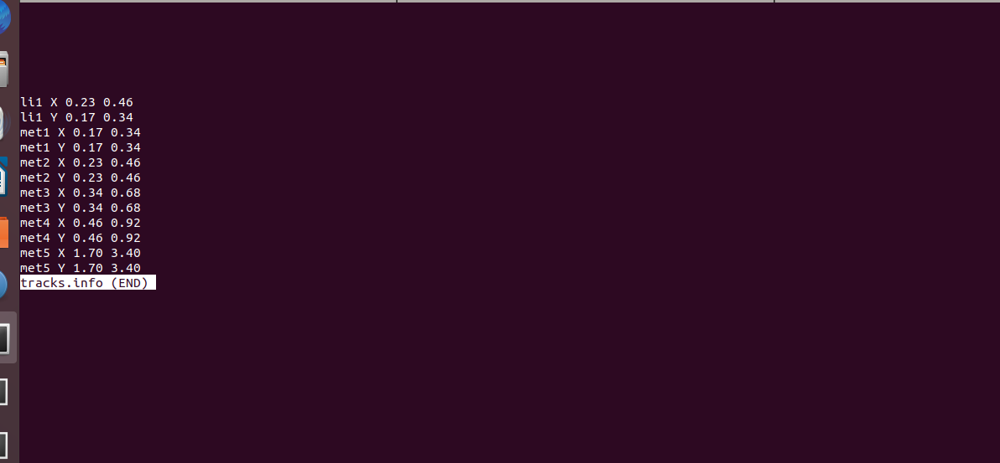
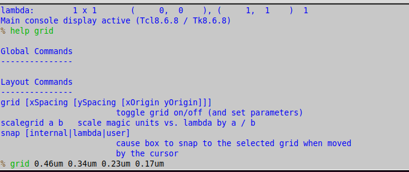
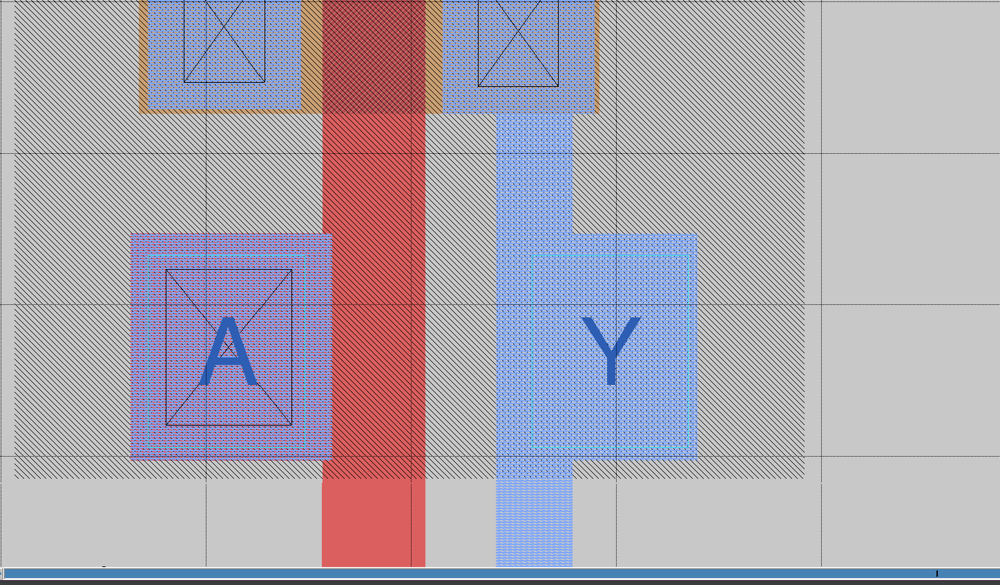
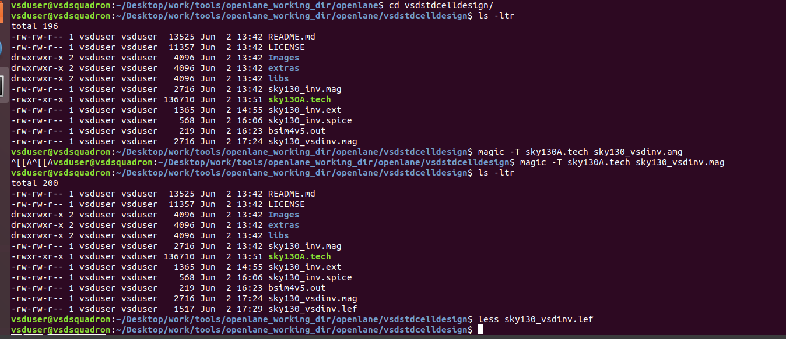
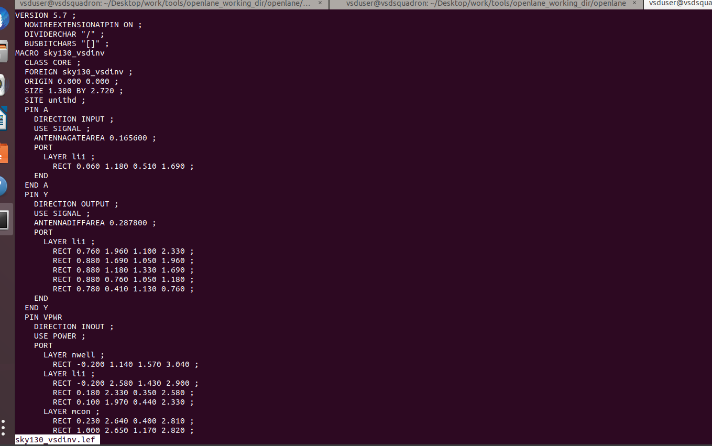
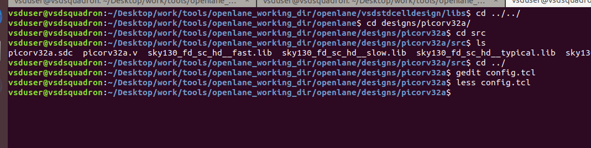
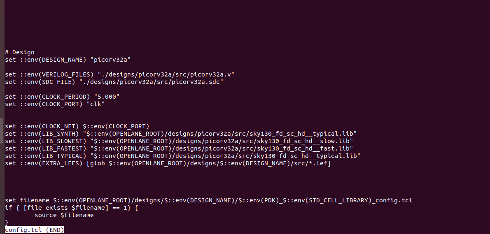
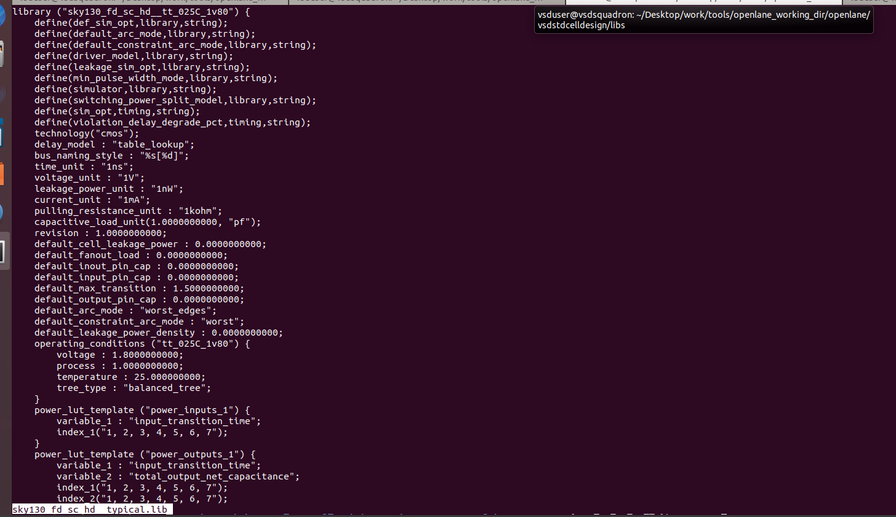
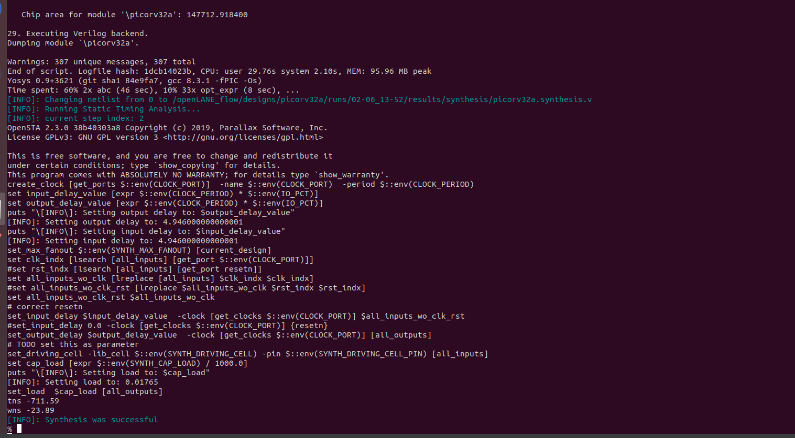

# SKY130 DAY 4 : Pre-Layout Timing Analysis and Importance of Good Clock Tree

## Lab Steps To Convert Grid Information Into Track Information

The `sky130_inv.mag` file (located in the vsdstdcelldesign directory) contains detailed information about the standard cell, such as:

 - Power and ground connections (P/G)

 - Port definitions

 - Logical function and internal layout

However, OpenLane is a physical design (PnR) tool. It does not require the full layout information found in the .mag file. Instead, OpenLane relies on a simplified abstraction—the Library Exchange Format (LEF)—that contains only essential data:

Required by OpenLane from .mag:

 - Cell boundary dimensions

 - Power and ground rail locations

 - Input/output (I/O) port locations

This is why we convert the .mag file into a .lef file before using it in a full-chip design like picorv32a.

### Standard Cell Design Guidelines

When designing a standard cell for use in a PnR flow like OpenLane, follow these critical guidelines:

> Port Placement

 - Input and output ports must lie at the intersection of horizontal and vertical routing tracks.

 - This ensures that the routing tools can legally and efficiently connect to these ports.

> Cell Dimensions

 - The cell height and width must be odd multiples of the vertical and horizontal track pitches, respectively.

 - This constraint aligns cells properly in the placement grid and helps avoid DRC violations during routing.

 > Understanding Tracks

 - Tracks are defined by the metal layers used for routing (e.g., met1, met2, etc.).

 - The routing grid is formed by the intersection of horizontal and vertical tracks, also known as the routing matrix.

The ~/Desktop/work/tools/openlane_working_dir/pdks/sky130A/libs.tech/openlane/sky130_fd_sc_hd/tracks.info contains track information.

This file contains:

 - Horizontal and vertical pitch values

 - Number of tracks per cell

 - Layer details (e.g., li1, met1, met2)

> Before extracting your LEF, ensure that your standard cell:
> 
> Aligns with the routing grid described in tracks.info
>
> Has port locations snapped to valid track intersections
>
> Respects the cell width/height guidelines

To do optimizations, we can keep open the tracks file and then open the tkcon window and type the help grid command. Then will write a command according to the track file required.

we can see that, the ports has been placed at the intersection of the tracks. Between the boundaries, 3 boxes are covered. so our second requirment also satisfies here.

Now we will start lef extraction process.

LEF [Library Exchange Format] which contains information of the standard cell library used in the design. The instructions to set the port definitions are available on vsdstdcelldesign github repo. Next, save the .mag file with a new filename by typing `lef write` in the tkcon terminal, which will generate a new lef file with the new filename 

## Introduction of Timing libs and Steps To Include New Cell in Synthesis

Inside this directory [pdks/sky130A/libs.ref/sky130_fd_sc_hd/lib/] are the liberty timing files for SKY130 PDK which have the timing and power parameters for each cell needed in STA. It can either be slow, typical, fast with different supply voltages (1v80, 1v65, 1v95), which are called PVT corners. The library named sky130_fd_sc_hd__ss_025C_1v80 describes the PVT corner as slow-slow [ie. delay is maximum], 25° Celsius temperature, at 1.8V power supply. Timing and power parameter of a cell are obtained by simulating the cell in a variety of operating conditions [i.e. different corners] and this data is represented in the liberty file, which characterizes all cells and is used during ABC mapping during synthesis stage which maps the generic cells to the actual standard cells available in the liberty file.

Copy the extracted lef file - named sky130_vsdinv.lef and the liberty files named sky130.lib* from this repository - /openlane/vsdstdcelldesign/libs to the src directory of picorv32a.

now i have to change the config.tcl file. Through this, we are setting the liberty file that will be used for ABC mapping of synthesis (LIB_SYNTH) and for STA (_FASTEST,_SLOWEST,_TYPICAL) and also the extra LEF files (EXTRA_LEFS) for the customized inverter cell.

this is a snapshot of typical lib file

After this, invoke the docker command and prepare the picorv32a design. Then, run synthesis using the run_synthesis command and check that sky130_vsdinv cell is successfully included in the design.

in the above picture, we can observe - 1. chip area = 147712.9  2. tns = -711.59  3. wns = 23.89  4. successful synthesis.

## Delay Table

