# SKY130 DAY 4 : Pre-Layout Timing Analysis and Importance of Good Clock Tree

## Lab Steps To Convert Grid Information Into Track Information

The `sky130_inv.mag` file (located in the vsdstdcelldesign directory) contains detailed information about the standard cell, such as:

 - Power and ground connections (P/G)

 - Port definitions

 - Logical function and internal layout

However, OpenLane is a physical design (PnR) tool. It does not require the full layout information found in the .mag file. Instead, OpenLane relies on a simplified abstraction—the Library Exchange Format (LEF)—that contains only essential data:

Required by OpenLane from .mag:

 - Cell boundary dimensions

 - Power and ground rail locations

 - Input/output (I/O) port locations

This is why we convert the .mag file into a .lef file before using it in a full-chip design like picorv32a.

### Standard Cell Design Guidelines

When designing a standard cell for use in a PnR flow like OpenLane, follow these critical guidelines:

> Port Placement

 - Input and output ports must lie at the intersection of horizontal and vertical routing tracks.

 - This ensures that the routing tools can legally and efficiently connect to these ports.

> Cell Dimensions

 - The cell height and width must be odd multiples of the vertical and horizontal track pitches, respectively.

 - This constraint aligns cells properly in the placement grid and helps avoid DRC violations during routing.

 > Understanding Tracks

 - Tracks are defined by the metal layers used for routing (e.g., met1, met2, etc.).

 - The routing grid is formed by the intersection of horizontal and vertical tracks, also known as the routing matrix.

The ~/Desktop/work/tools/openlane_working_dir/pdks/sky130A/libs.tech/openlane/sky130_fd_sc_hd/tracks.info contains track information.

This file contains:

 - Horizontal and vertical pitch values

 - Number of tracks per cell

 - Layer details (e.g., li1, met1, met2)

> Before extracting your LEF, ensure that your standard cell:
> 
> Aligns with the routing grid described in tracks.info
>
> Has port locations snapped to valid track intersections
>
> Respects the cell width/height guidelines

To do optimizations, we can keep open the tracks file and then open the tkcon window and type the help grid command. Then will write a command according to the track file required.

we can see that, the ports has been placed at the intersection of the tracks. Between the boundaries, 3 boxes are covered. so our second requirment also satisfies here.

Now we will start lef extraction process.

LEF [Library Exchange Format] which contains information of the standard cell library used in the design. The instructions to set the port definitions are available on vsdstdcelldesign github repo. Next, save the .mag file with a new filename by typing `lef write` in the tkcon terminal, which will generate a new lef file with the new filename 

## Introduction of Timing libs and Steps To Include New Cell in Synthesis

Inside this directory [pdks/sky130A/libs.ref/sky130_fd_sc_hd/lib/] are the liberty timing files for SKY130 PDK which have the timing and power parameters for each cell needed in STA. It can either be slow, typical, fast with different supply voltages (1v80, 1v65, 1v95), which are called PVT corners. The library named sky130_fd_sc_hd__ss_025C_1v80 describes the PVT corner as slow-slow [ie. delay is maximum], 25° Celsius temperature, at 1.8V power supply. Timing and power parameter of a cell are obtained by simulating the cell in a variety of operating conditions [i.e. different corners] and this data is represented in the liberty file, which characterizes all cells and is used during ABC mapping during synthesis stage which maps the generic cells to the actual standard cells available in the liberty file.

Copy the extracted lef file - named sky130_vsdinv.lef and the liberty files named sky130.lib* from this repository - /openlane/vsdstdcelldesign/libs to the src directory of picorv32a.

now i have to change the config.tcl file. Through this, we are setting the liberty file that will be used for ABC mapping of synthesis (LIB_SYNTH) and for STA (_FASTEST,_SLOWEST,_TYPICAL) and also the extra LEF files (EXTRA_LEFS) for the customized inverter cell.

this is a snapshot of typical lib file

After this, invoke the docker command and prepare the picorv32a design. Then, run synthesis using the run_synthesis command and check that sky130_vsdinv cell is successfully included in the design.

in the above picture, we can observe - 1. chip area = 147712.9  2. tns = -711.59  3. wns = 23.89  4. successful synthesis.

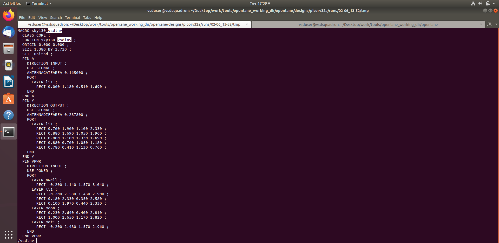

## Next steps were to configure OpenSTA for post-synth timing analysis

We have do STA on the picorv32a design which had timing violations.First we will run the synthesis using the following commands in openlane directory

` docker`
`./flow.tcl -interactive`
`package require openlane 0.9 `
`prep -design picorv32a`
`set lefs [glob $::env(DESIGN_DIR)/src/*.lef]`
`add_lefs -src $lefs `
`set ::env(SYNTH_SIZING) 1 `
`run_synthesis `

Now we have to make a new pre_sta.conf file. We can do this by vim editor or in simple text editor also.

Now we will create a my_base.sdc file which will have the definitions of environment variables. It is present in src folder in picorv32a.

Now will go to the openlane directory in a new terminal and execute the sta pre_sta.conf command.

I got confused here some of the steps therefore some of the things were not done properly and i dont have screenshots.

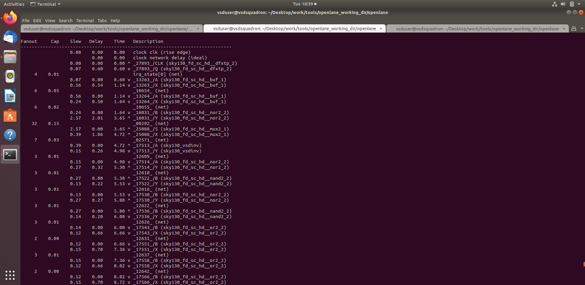

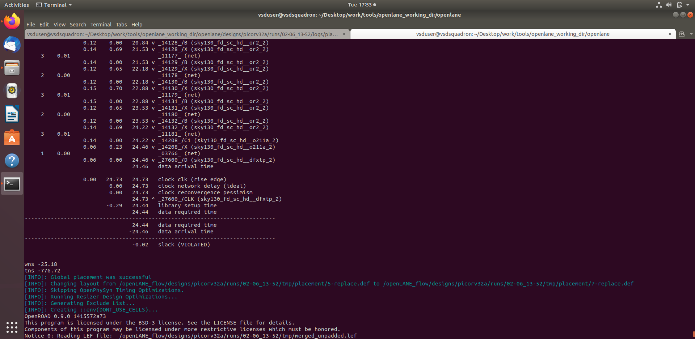

### Lab steps to configure synthesis settings to fix slack and include vsdinv

We will try to modify the parameters of our cell by referring the README.md file in the configuration folder in openlane directory

We will give the following commmands in the terminal in openlane directory

`prep -design picorv32a -tag 01-04_12-54 -overwrite`

`echo $::env(SYNTH_STRATEGY)`

`set ::env(SYNTH_STRATEGY) "AREA 0"

`echo $::env(SYNTH_BUFFERING)`

`echo $::env(SYNTH_SIZING)`

`set ::env(SYNTH_SIZING) 1`

`echo $::env(SYNTH_DRIVING_CELL)`

`run_synthesis`

prep -design picorv32a -tag 01-04_12-54 -overwrite is used to overwrite the existing files with previous values of simulations.

After synthesis, we have observed that the slack is nagative.

wns(worst negative slack)= -16

tns(total negative slack)= -385

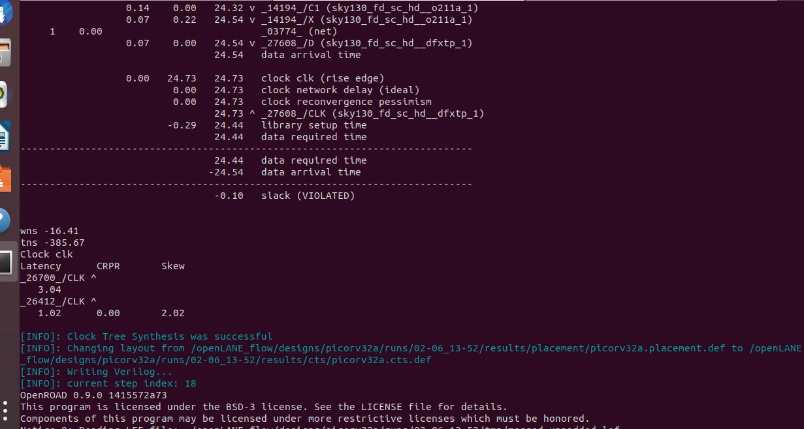

I will have to do run_floorplan

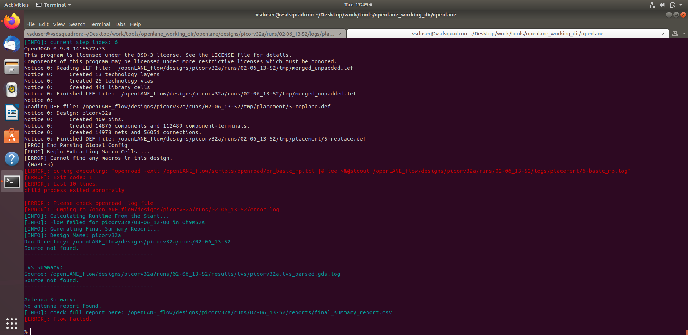

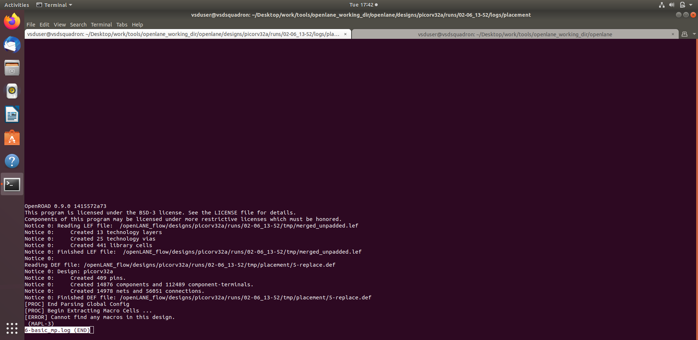

Due to the error the i am not able to take magic layout. But the way to resolve this is, we will use the following commands to do the floorplan,

`init_floorplan`

`place_io`

`tap_decap_or`

Now i have done run_placement

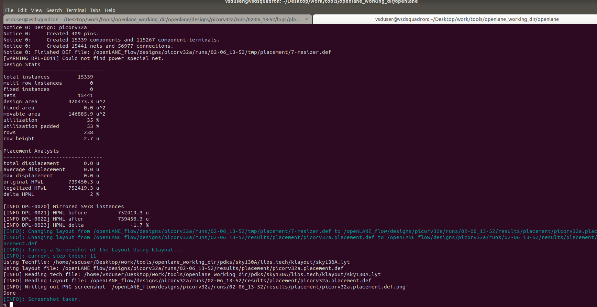

Now we have to make a new pre_sta.conf file. We can do this by vim editor or in simple text editor also.

Now we will create a my_base.sdc file which will have the definitions of environment variables.

Now, we also need to create my_base.sdc file having the data shown in below image in openlane/designs/picorv32a/src directory

The various commands to be run and their functions are -:

`create_clock` -it creates clock for the port with specified time period.

`set_input_delay` and `set_output_delay` - defines the arrival/exit time of an input/output signal relative to the input clock. [This is the delay of the signal coming from an external block and internal delay of the signal to be propagated to external ports] This adds a delay of Xns relative to clk to all signals going to input ports, and delay of Yns relative to CLK to all signals going to output ports.

`set_max_fanout` - specifies maximum fanout count for all output ports in the design.

`set_driving_cell` - models an external driver at the input port of the current design.

`set_load` sets a capacitive load to all output ports.

Execute sta pre_sta.conf and check timing.

### Lab steps to do basic timing ECO

we can follow the below commands of replace-

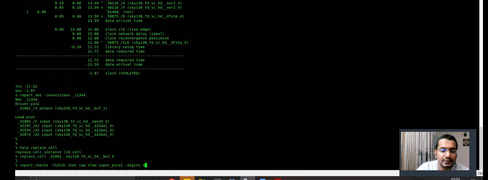

Now we need to replace the old netlist with newly generated netlist which has generated after reducing the slack. And then we will run floorplan , placement and CTS.

So, we need to make a copy of this old netlist and then we will add the newly generated netlist to be used in our openlane flow for further process.

Now we will do synthesis again then floorplan , placement and cts in the openlane directory.

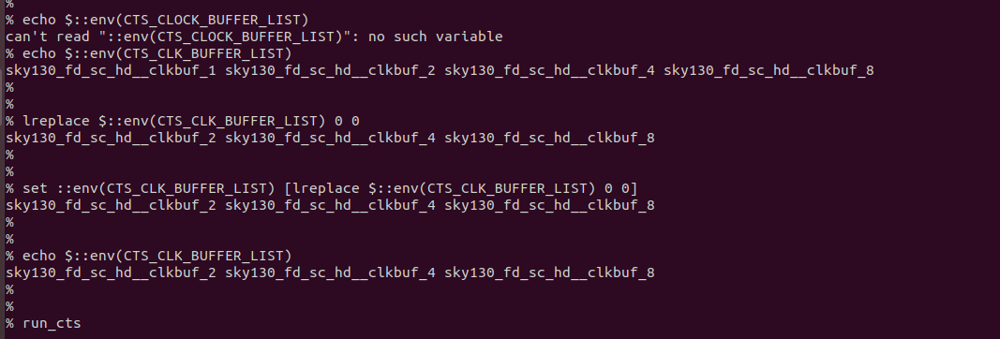

### Lab Steps to Verify CTS Runs

After the previous step, OpenLANE will take the procedures from /Desktop/work/tools/openlane_working_dir/openlane/scripts/tcl_commands and eventually invoke OpenROAD to run the tools.

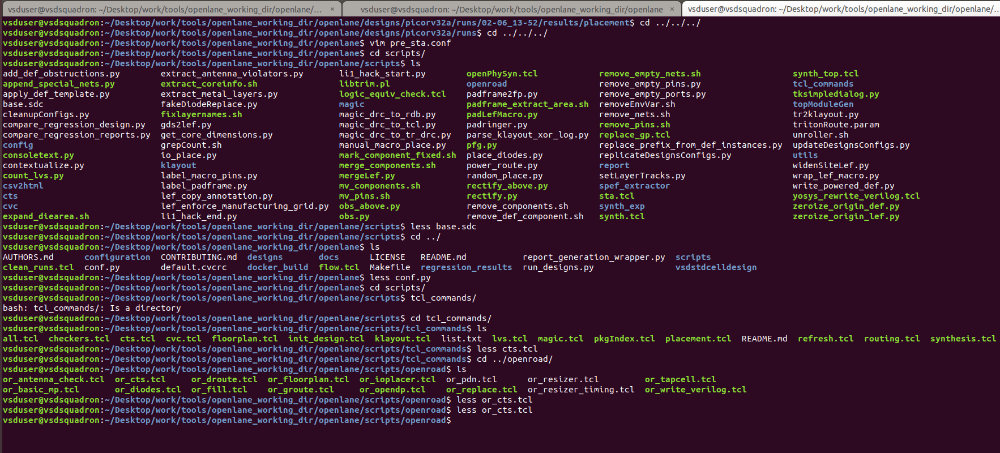

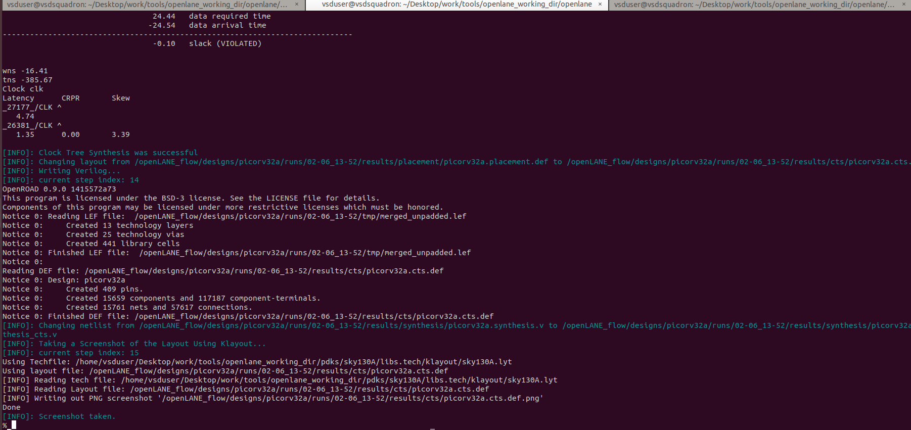

For example, the command run_cts is found in the location /OpenLane/scripts/tcl_commands/cts.tcl. This tcl process will invoke OpenROAD which will call the cts.tcl which contains the OpenROAD commands for TritonCTS.

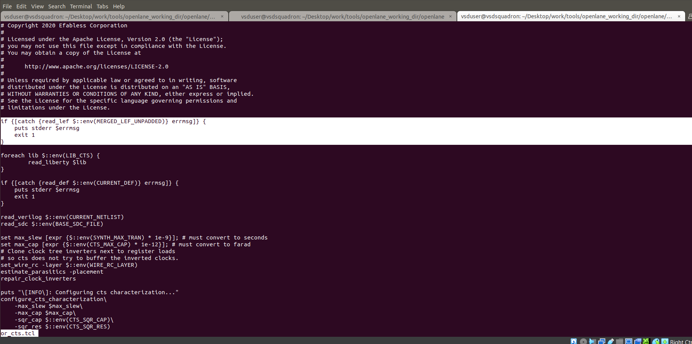

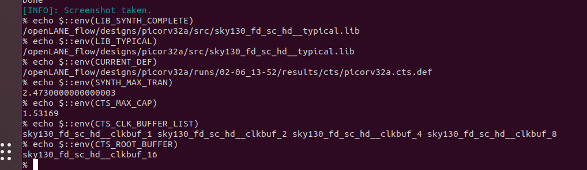

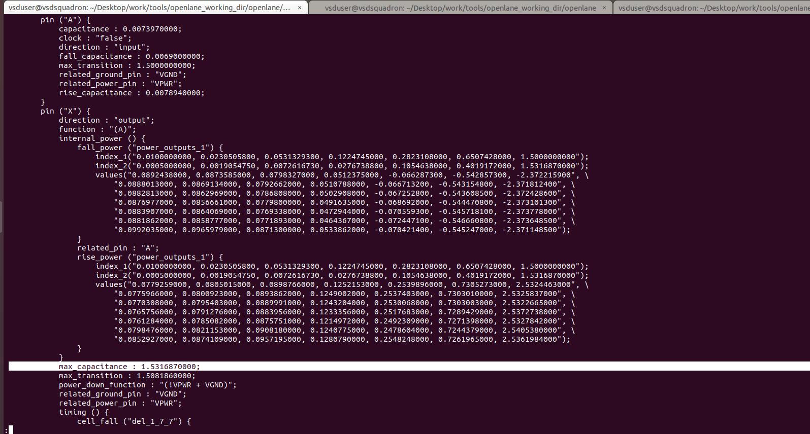

> The file contains many configuration variables for CTS like-:

> CTS_CLK_BUFFER_LIST -> which has the list of clock buffers used in clock tree branches (sky130_fd_sc_hd__clkbuf_1 sky130_fd_sc_hd__clkbuf_2 sky130_fd_sc_hd__clkbuf_4 sky130_fd_sc_hd__clkbuf_8)
> 
> CTS_ROOT_BUFFER -> this is the clock buffer used for the root of the clock tree and is the biggest clock buffer to drive the clock tree of the whole chip (sky130_fd_sc_hd__clkbuf_16)
> 
> CTS_MAX_CAP -> it is a numerical value for the maximum capacitance of the output port of the root clock buffer

### Lab Steps to Analyse Timing With Real Clocks Using OpenSTA

The aim is to analyse the clock tree explained previously. The steps for analysis of timings with real clocks are -:

Enter into OpenROAD using the openroad command.
NOTE: In OpenROAD, timing is done slightly differently, where in a db is created from lef and def files and subsequently used

Subsequently create the db file through this command -: *read_lef [location of merged.lef]

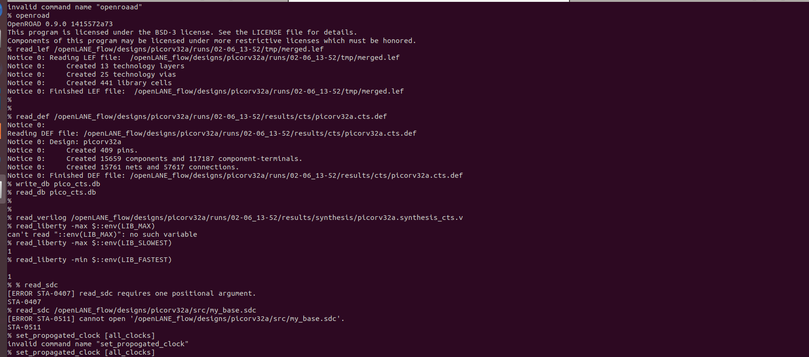

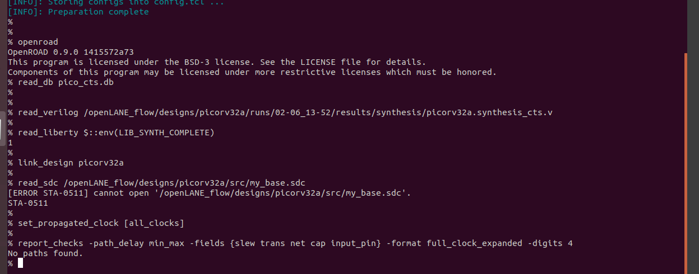

Follow the above steps and mine flow is not working but the commands can be observed to implement it.

## Delay Table

In case of AND gate, ONLY when the enable pin is equal to 1, the CLK propagates to Y. Similarly, in case of OR gate, the CLK propogates to Y only when the enable pin is 0. Whenever the enable pin is equal to 1, the CLK does not propogate and there is no short circuit power consumption. Switching power consumption when such elemements are used is used in CLOCK TREE. This method is known as **Clock Gating Technique**.

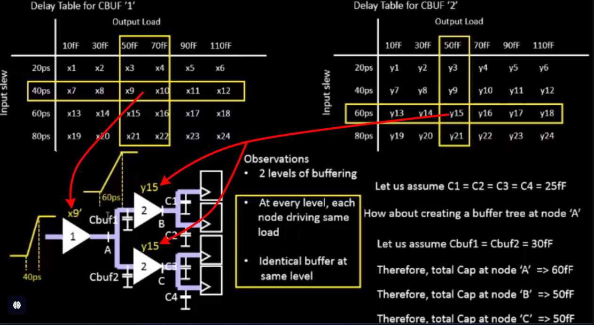

We see through the above picture that buffers on different levels have different capacitive loads and buffer sizes but as long as they have the same loads and sizes in the same level, the total delay for each clock tree path will be the same and, so skew will remain zero. However, we can observe that practically, different levels can have varying input transition and output capacitive load and hence varying delay.

We use delay tables to observe each cell's timing models that is included inside the .lef files. The element that majorly impacts delay is output slew, which depends on capacitative load and the input slew [which is a function of previous stage buffer's output capacitive load and input slew and has its own transition delay table.]

We notice at level 2 that both buffers have identical delays due to equal transition times, load capacitances and buffers sizes. Observe that the skew is zero. If this is not true, the skew will be negative, which will cause timing violations. On a small scale, these are often considered to be insignificant but we see their importance in large designs which millions of cells, where in if we fail to adhere to guidelines during clock tree creation, many timing-related complications can be caused.

CTS is the process of designing a clock distribution network to minimize skew and ensure synchronous operation of the circuit

Skew refers to the variation in clock signal arrival times, and slew [rate] is the rate of change of signal's voltage on time

Latency is the delay experienced by the clock signal

## Timing Analysis With Ideal Clocks Using Open STA

Consider an ideal clock where perform timing analysis to understand the parameters [Clock frequncy (F) is 1GHz and clock period (T) is 1ns]. -:

The setup timing analysis equation is = Θ < T - S

Θ = Combinational delay which includes clk to Q delay of launch flop and internal propagation delay of all gates between launch and capture flop

T = Time period, also called the required time

S = Setup time. Signal must settle on the middle (input of Mux 2) before clock tansists to 1 so the delay due to Mux 1 must be considered, this delay is the setup time.

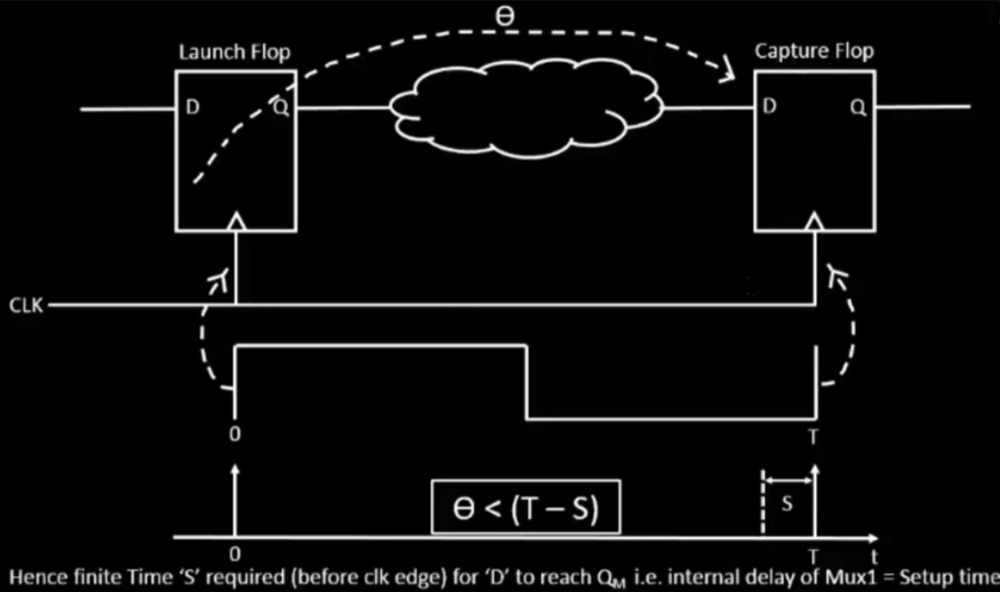

CLK signals are sent to the device by the PLL (Phase Locked Loop). This clock source is expected to send clock signal at 0, T, 2T etc. However, even these clock sources might or might not be able to provide a clock exactly at Tns because of its own in-built variation known as **jitter**. Jitter can be thought of as short-term fluctuations in the timing of signal transitions, which can result in deviations from the expected clock or data timing.

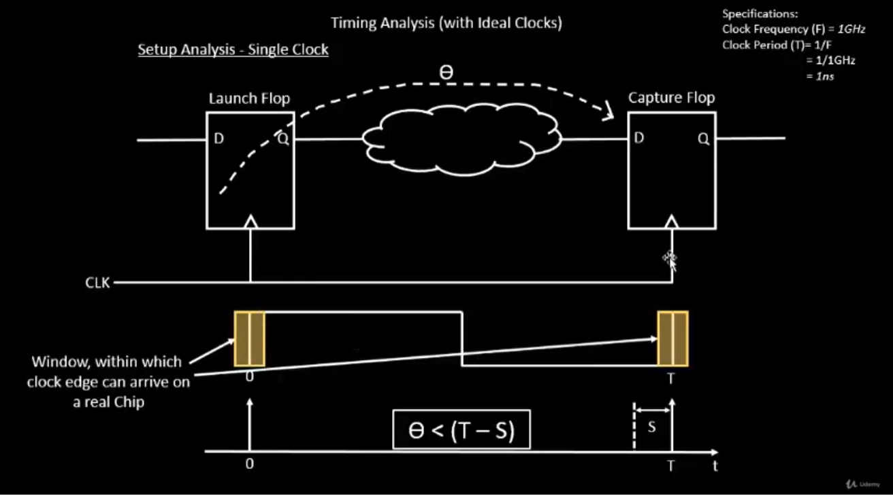

Now, we see that a new equation for setup time is = `Θ < T - S - SU`

SU = Setup uncertainty due to jitter which is temporary variation of clock period, which is due to non-idealities of PLL.

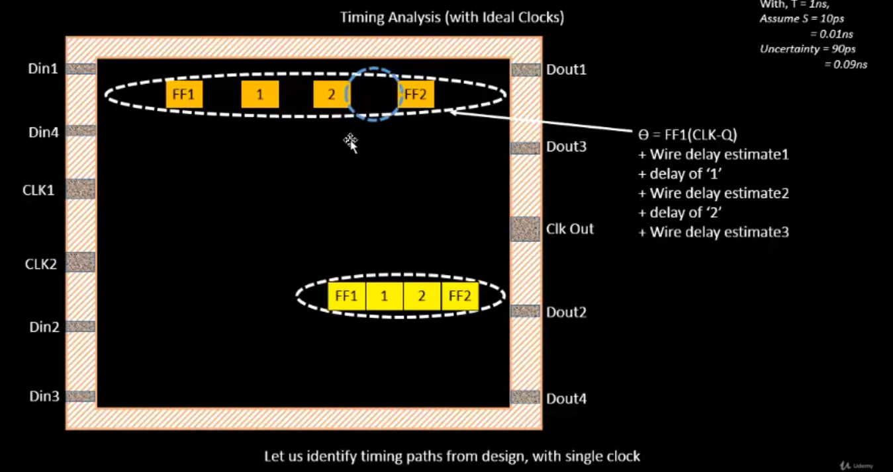

### Clock Tree Routing and Buffering Using H-Tree Algorithm

In the context of digital design, **clock skew** refers to the difference in the arrival time of the clock signal at different flip-flops. 

Let’s consider a `CLK` port connecting to various flip-flops in a digital system. the clock signal has been routed arbitrarily, causing:

- Arrival time at flip-flop 1: `t1`
- Arrival time at flip-flop 2: `t2`

If `t2 > t1`, the **skew** is defined as:

Skew = t2 - t1

Clock skew can arise due to:

- 📏 **Differences in wire lengths**
- 🛣️ **Variations in routing paths**
- ⚡ **Buffer delay inconsistencies**
- 🌡️ **Physical/environmental factors (e.g., temperature, voltage)**

This can result in parts of the system receiving the clock signal earlier or later than others.

> **Note:** *Ideally, the clock skew should be **zero***.

Reducing clock skew is critical to:

- ✅ Ensure proper **signal synchronization**
- ✅ Guarantee **reliable circuit operation**

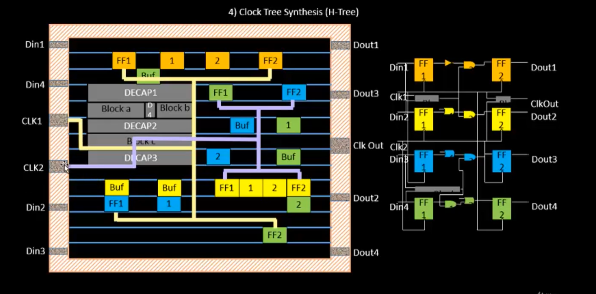

To solve this, we use **H-Tree routing**, an approach designed to balance the clock signal delivery:

1. Calculate distances from the clock source to all endpoints.
2. Determine a **central point** to begin tree construction.
3. Split the route symmetrically by creating **midpoints**.
4. Repeat the process recursively until all flip-flops are reached.

This helps ensure the clock reaches all endpoints **at nearly the same time**, minimizing skew.

#### 🔌 Clock Buffers / Repeaters

- Maintain **signal strength** across long routes.
- Ensure **timing accuracy**.

### 🆚 Clock Buffers vs. Data Buffers

| Parameter           | Clock Buffers          | Data Buffers           |
|---------------------|------------------------|------------------------|
| Rise/Fall Time      | **Equal**              | **Can differ**         |
| Purpose             | Uniform propagation    | Data-specific behavior |

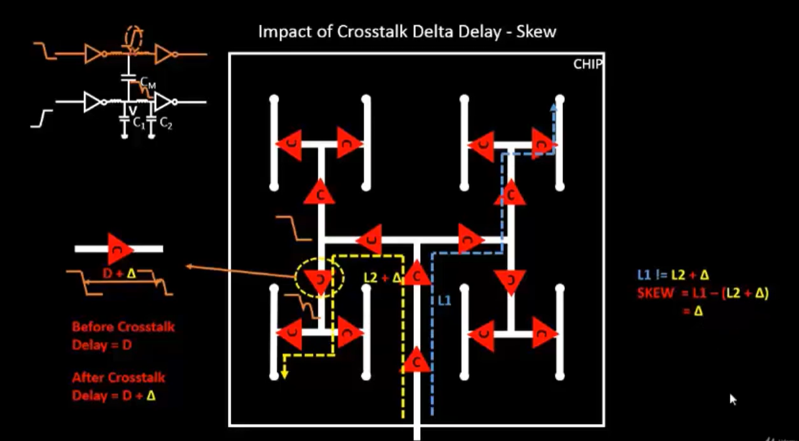

Clock nets are **critical** and highly sensitive. One major threat is **crosstalk**:

#### ⚠️ What is Crosstalk?

When a signal in one net (**aggressor**) interferes with an adjacent net (**victim**) due to **high coupling capacitance**, it causes:

1. **Glitches** (voltage dip in victim net)
2. **Delta Delay** (unexpected timing delays)

This leads to:
- Incorrect memory values
- Faulty circuit behavior

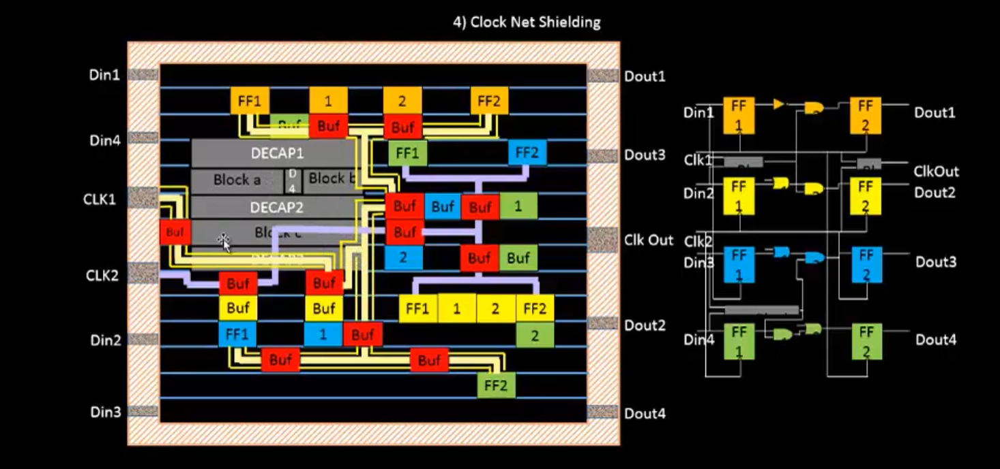

#### 🛡️ Solution: Shielding Clock Nets

- **Shielding** breaks the coupling between aggressor and victim nets.
- Shielding wires are connected to **VDD or VSS**, which **do not switch**.
- As a result, the victim net remains unaffected.

  ## Timing Analysis With Real Clocks Using Open STA

  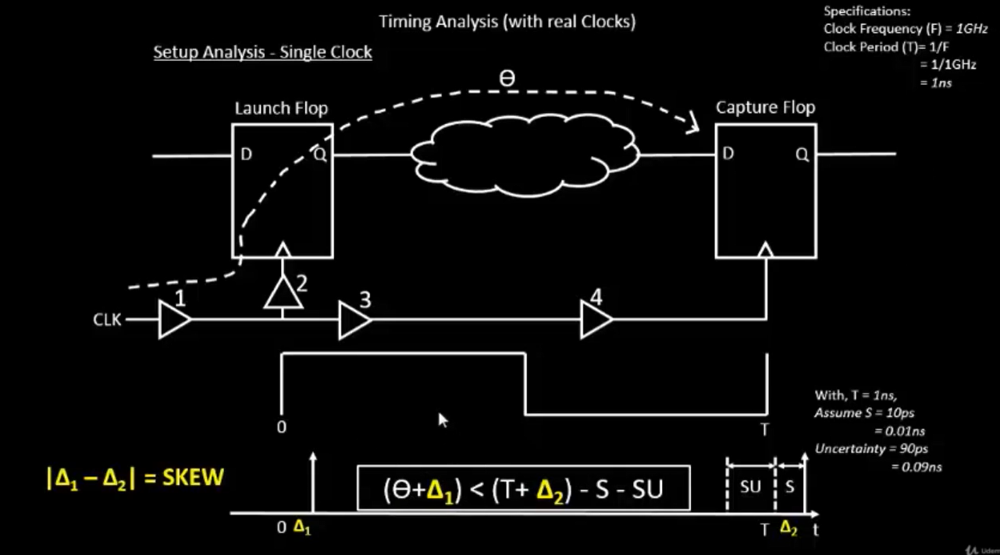

> delta1 = launch flop clock network delay

> delta2 = capture flop clock delay

Any design satisfying Slack [i.e. Data required time - Data arrival time] is ready to work in the given frequency. However, if this equation is violated, then slack will become negative which is not expected. We expect slack to be either zero or positive.

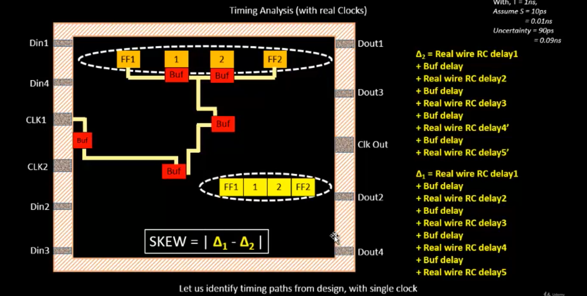

### Hold Timing Analysis Using Real Clocks
Hold Time is delay [time] needed by the MUX2 model within a flip-flop to transfer certain data outside. [i.e. how long it holds the data]. It is the time period during which the launch flop must retain data before it reaches the capture flop. Unlike setup analysis, which has two rising clock edges, hold analysis occurs on the same rising clock edge for both the launch and capture flops.

A hold violation occurs when the path is too fast, impacted by factors such as -:

 - combinational delay
 - clock buffer delays
 - hold time.
Notably, parameters such as time period and setup uncertainty hold no significance, as both launch and capture flops receive identical rising clock edges during hold analysis.

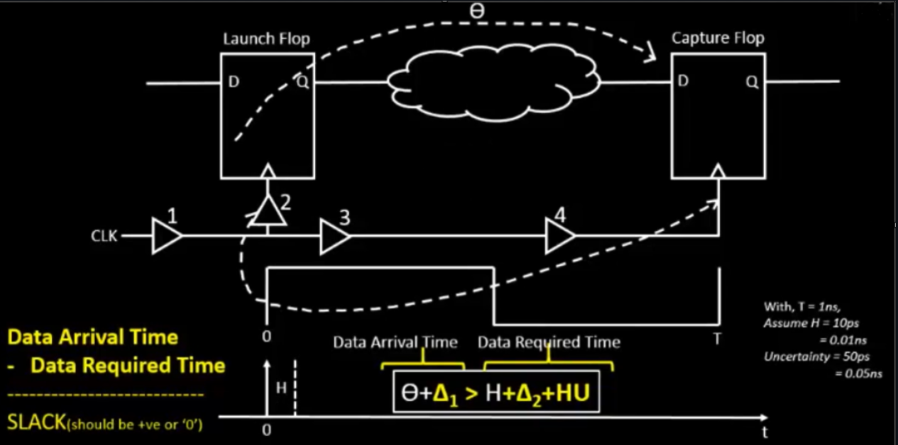

