# Sky130 Day 5 -Final step for RTL2GDS using tritinRoute and openSTA
## Routing and Design Check [DRC]
### Introduction to Maze Routing and Lee's Algorithm

**Routing** is the process of finding the best possible physical connection between two elements (such as clocks, flip-flops, etc.) in a chip design. 

Over time, many algorithms have been developed for this purpose, including:
- **Steiner Tree Algorithm**
- **Line Search Algorithm**
- **Lee's Maze Routing Algorithm** (focus of this section)

Routing aims to find:
- The **shortest**, most **efficient** path
- Minimal bends or **zig-zags**
- **L-shaped** or Manhattan-style routes (no diagonals)

From a software perspective, routing means searching and connecting the required points algorithmically. From a physical design standpoint, it is the placement of **actual metal wires** that carry signals across the chip.

---
**Lee’s Algorithm** is widely used in maze-type routing problems where the design space is modeled as a **grid or mesh**. This makes it well-suited for VLSI routing problems.

#### 🧮 Steps of Lee’s Algorithm

1️⃣ Initialization

- A **grid or routing matrix** is created in the area to be routed.
- Each grid cell is categorized as one of the following:
  - 🟥 **Obstacle** (blocked region like macros/HIPs)
  - ⬜ **Empty** (available for routing)
  - 🟦 **Visited** (explored by the algorithm)
  - 🟩 **Source (S)** (starting point)
  - 🟨 **Target (T)** (destination point)

 2️⃣ Wave Expansion

- Begins from the **source cell (S)**.
- Spreads outward in all 4 cardinal directions (up, down, left, right).
- Each neighbor cell is assigned a value `= previous + 1`, avoiding obstacles.
- Continues until:
  - The **target cell (T)** is reached, or
  - No more cells can be explored

This "wave" process mimics water filling a maze.

---

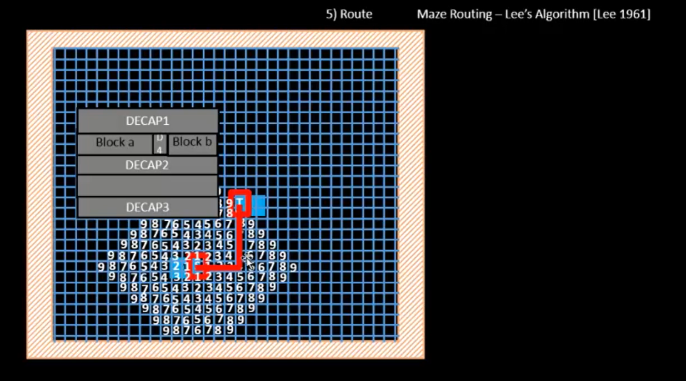

## ✅ Conclusion: Backtracking & Path Reconstruction

Once the target is reached:

- The algorithm **backtracks** from the target to source by following decreasing cell values.
- This reveals the **shortest path** with the **least number of bends**.
- The selected route:
  - ❌ Must not be diagonal
  - ❌ Must not overlap blockages like macros or HIPs
  - ✅ Should follow **Manhattan geometry**

---

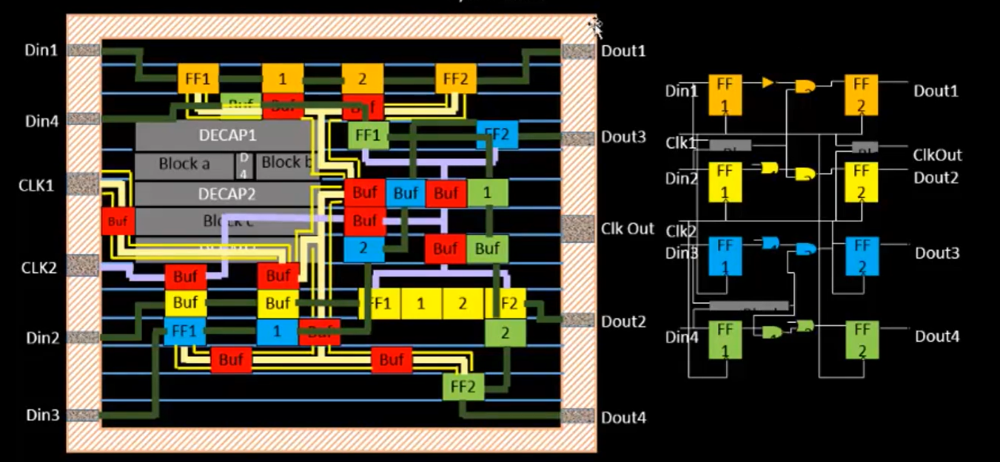

## 🧪 Design Rule Check (DRC)

Routing is not just about finding a path—it must **comply with fabrication rules**, such as:

- Minimum **wire width**
- Minimum **spacing between wires**
- Minimum **pitch**
- Legal **via usage** between metal layers

Hence, **DRC cleaning** is performed after routing to ensure:

- The routed layout is **manufacturable**
- No **short circuits** or **overlaps** exist

---

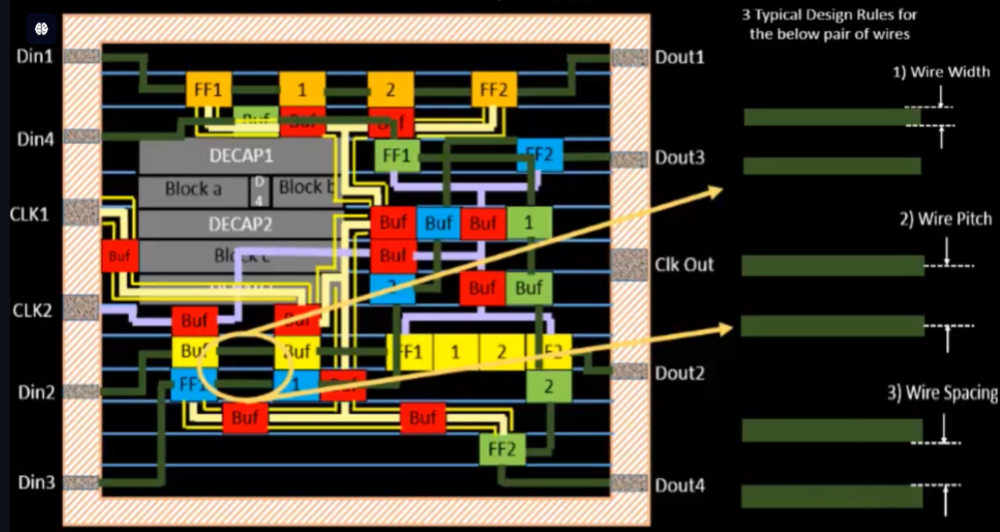

## ⚠️ Signal Shorts and Layer Switching

A common routing issue is **signal shorting**, which can lead to:

- Functional failure
- Setup or hold violations

### 🛠️ Solution: Move Route to Higher Metal Layer

To resolve:
- Route may be moved to a **higher metal layer**
- This introduces **vias**, which must also follow DRCs:
  - Minimum **via width**
  - Minimum **via spacing**
  - Higher metal layers often require **wider wires**
    
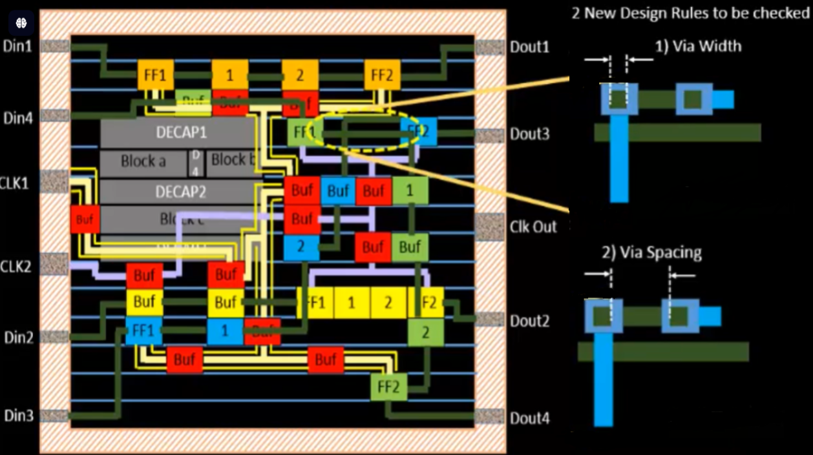
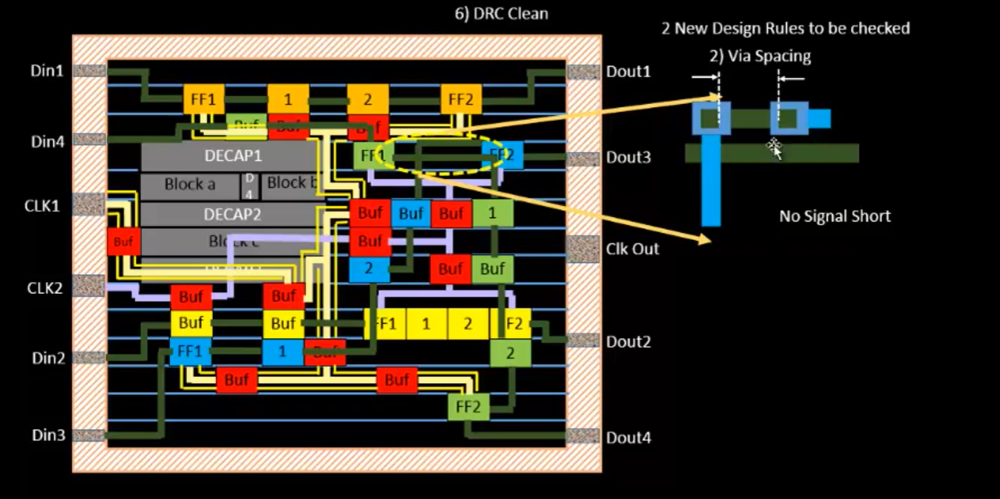

## Basics of Global and Detail Routing and Configure TritonRoute

TritonRoute is the engine that is used for routing through the run_routing command.

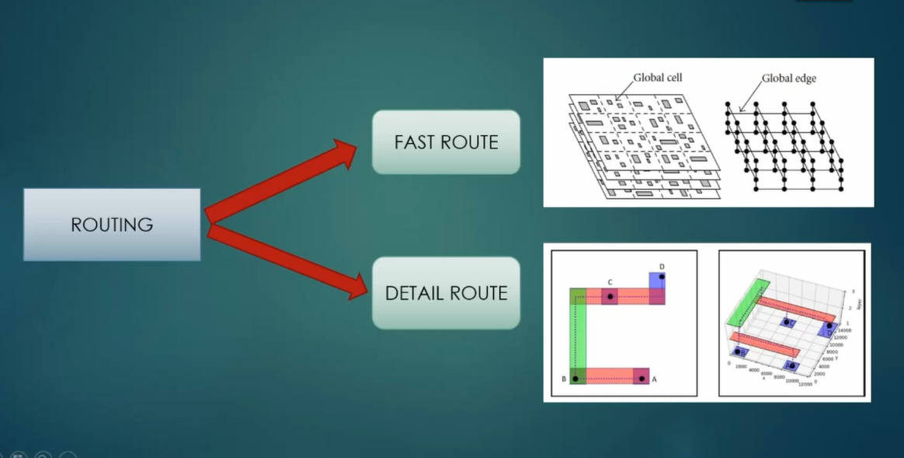

In the VLSI flow, the routing stage is highly critical and can be executed using either open-source or commercial tools. This stage is divided into two phases:

Global Route / Fast Route:

This is accomplished using fast routing techniques where the area to be routed is partitioned into tiles or rectangles. Global routing establishes the initial framework for routing paths. Detail Route:

This phase involves meticulous tracking routing techniques to complete the routing process. Detailed routing fine-tunes and finalizes the paths to ensure proper connectivity and compliance with design constraints.

In VLSI, routing is extremely important and is either done through open-source/commericial tools. It has mainly two phases -:

Global Route - Also known as fast route, it uses fast routing techniques wherein we partition the area to routed into tiles/rectangles. It establishes the initial framework
Detailed Route - This process uses more meticulous routing techniques, and completes the process by fine-tuning and finalizing the paths to ensure connectivity and compliance with DRC.

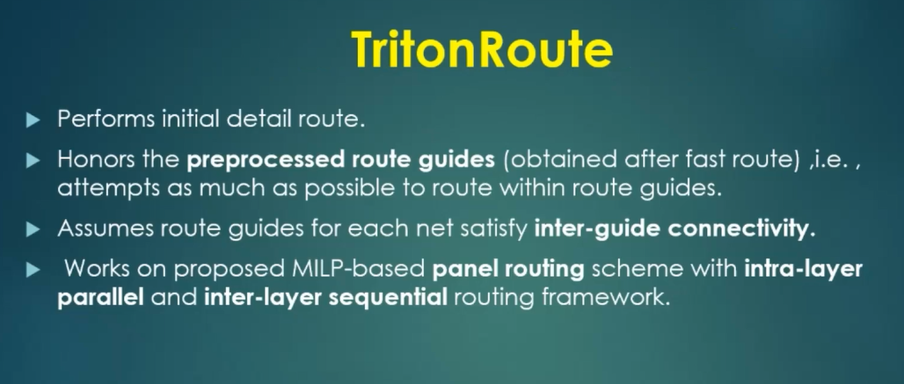

### Features 

⚙️ TritonRoute Feature 1 – Honors Pre-Processed Route Guides

TritonRoute respects pre-defined **routing guides**, which help streamline the routing process.

- **Preferred routing directions:**
  - **M1** → Vertical
  - **M2** → Horizontal

- When a **non-preferred direction** is encountered:
  - The tool performs **splitting**: divides the segment into **unit width sections**
  - Segments **aligned with the preferred direction** are then **combined**
  - **Bridging** is used to connect these sections through **upper metal layers**
  - Final **non-preferred routes** are translated into **preferred M2 guides**

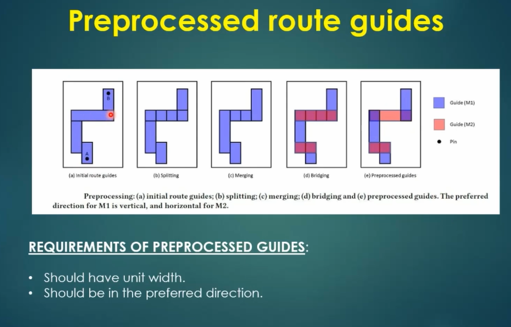

🔗 TritonRoute Features 2 & 3 – Inter-Guide Connectivity & Layered Routing

#### 🧭 Inter-Guide Connectivity

- **Panels** are vertical strips marked by dashed lines, each having its own routing guide.
- **M1 preferred direction:** Vertical  
  So, routing tends to create **vertical lines** in M1.

#### 🔄 Intra & Inter-Layer Routing

- **Even-indexed panels** are routed **first in parallel**
- Followed by **odd-indexed panels**
- This ensures efficient **intra-layer routing** before routing progresses to other layers.

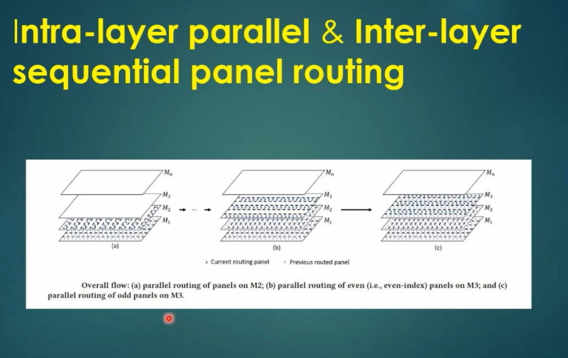

### 🧠 MILP (Mixed Integer Linear Programming)

Used to determine **optimal connections between two APCs (Access Point Clusters)**.

Steps involved:
1. Calculate **cost** for each access point
2. Build a **Minimum Spanning Tree (MST)** based on cost
3. Select the **minimum-cost, most optimal connection point** between APCs

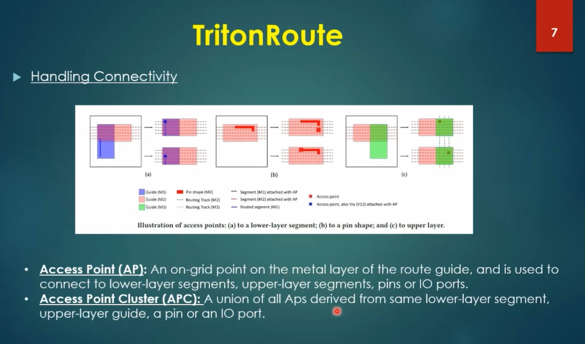

📐 Routing Topology & Final Output Files

After executing the `run_routing` command:

- Both **global** and **detailed routing** are performed.
- **Routing Strategy = 0**:  
  TritonRoute aims to reduce **DRC violations** from a high number (e.g. **25,000**) down to **0**.
  
- This is done through:
  - **Iterative refinement** (e.g., **34 iterations**)
  - Duration: Typically takes **20 to 30 minutes**
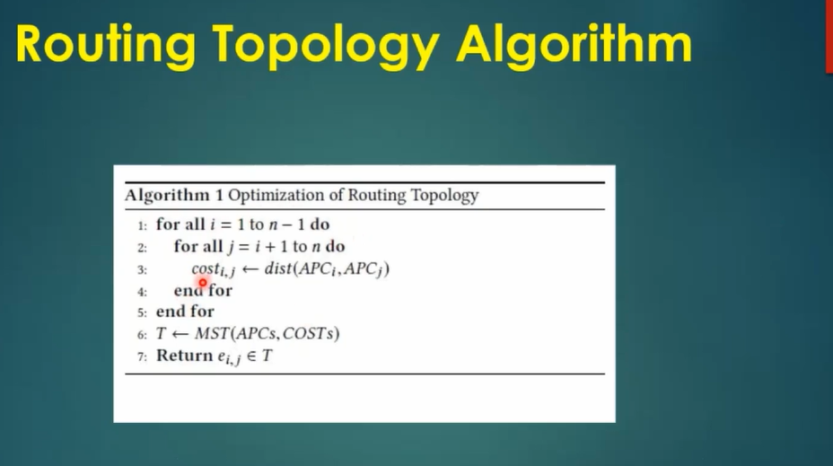

